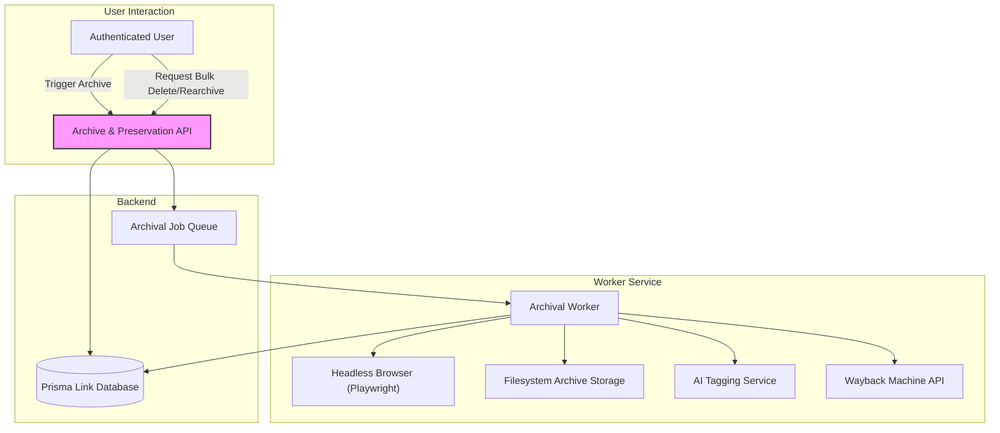

# Archive & Preservation API Reference

Enable lasting capture and reliable retrieval of web content with Linkwarden's powerful Archive & Preservation API. This API empowers you to trigger, manage, and automate the archiving of webpages in multiple formats including PDF, screenshots, Wayback Machine snapshots, and single-file HTML captures. Gain control over preserving knowledge assets so they remain accessible, even if the source web content vanishes.

---

## API Overview

### Base URL
All endpoints described in this reference are accessed under the base path:

```
/api/v1/links/{id}/archive
```

- `{id}` is the numeric identifier of the Link (bookmark) you wish to archive or manage.

### Supported Methods
- `PUT`: Initiates or resets the archiving process for a specific link.
- `DELETE`: Bulk or targeted deletion and management of archived content.

### Authentication
All requests require an authenticated user session. Authentication is verified automatically, and only users with appropriate permissions on the link's collection can invoke archiving or deletion operations.

### Rate Limiting
Please adhere to your deployment’s API rate limits to avoid throttling. Batch operations should be spaced appropriately.

### Supported Formats
Archival can target multiple content preservation formats:
- **PDF**: A snapshot of the webpage saved as PDF.
- **Screenshot**: An image capture, either JPEG or PNG.
- **Monolith**: A single-file HTML archive representing the entire page.
- **Readability**: Clean, simplified HTML content for focused reading.
- **Wayback Machine**: Submission to Internet Archive’s Wayback Machine.

---

## Authentication & Authorization

- Users must authenticate via standard Linkwarden methods (e.g., session tokens or API tokens).
- Access to archive or modify a link’s preservation state requires update or delete permissions on the link’s collection.
- Administrative actions (e.g., bulk deletions or re-preserving all links) require server admin privileges.

---

## Endpoints

### 1. Initiate or Reset Archiving for a Link

**PUT /api/v1/links/{id}/archive**

Trigger a preservation job for the specified link, clearing any prior archive data to enforce fresh archival.

#### Request
- Path Parameter:
  - `id` (integer): Link identifier.

- Headers:
  - `Authorization`: User session token or API token.

- Body: None

#### Behavior
- Validates user permission for the given link.
- Validates the URL of the link is accessible and sound.
- Clears existing archive data fields (`image`, `pdf`, `readable`, `monolith`, `preview`, `lastPreserved`).
- Deletes archived files associated with the link from the filesystem.
- Queues link for asynchronous archival processing.

#### Response
- HTTP 200: `{ "response": "Link is being archived." }`
- HTTP 400: If in demo mode or URL invalid.
- HTTP 401: Permission denied.
- HTTP 404: Link not found.

#### Example
```bash
curl -X PUT \
  -H "Authorization: Bearer <token>" \
  https://your-domain.com/api/v1/links/123/archive
```

---

### 2. Bulk Delete or Manage Archived Content

**DELETE /api/v1/links/archive**

Allows bulk removal of archived files for specified links or all links, plus administrative operations to mark archives as unavailable or re-preserve them.

#### Request Body Schema
```json
{
  "action": "string",      
  "linkIds": ["number"]
}
```

- `action` (optional): A string controlling behavior for bulk operations. Values:
  - `allAndIgnore`: Mark all archives as unavailable without deleting previews (admin only).
  - `allAndRePreserve`: Delete archives and reset preservation fields to trigger re-archiving (admin only).
  - `allBroken`: Target only broken archival entries for reprocessing (admin only).

- `linkIds` (optional): Array of link IDs for targeted deletion of linked archives.

#### Behavior
- Validates user permissions for each link.
- If `linkIds` is provided, deletes archived files and resets archive status fields for those links.
- If admin actions invoked, processes all or broken archives accordingly.
- Logs each deletion or update.

#### Response
- HTTP 200: `{ "response": "Success." }`
- HTTP 400: Invalid request schema or parameters.
- HTTP 401: Permission denied.

#### Example - Delete Specific Links
```bash
curl -X DELETE \
  -H "Authorization: Bearer <token>" \
  -H "Content-Type: application/json" \
  -d '{"linkIds": [123, 456]}' \
  https://your-domain.com/api/v1/links/archive
```

#### Example - Admin Re-Preserve All Broken Archives
```bash
curl -X DELETE \
  -H "Authorization: Bearer <admin_token>" \
  -H "Content-Type: application/json" \
  -d '{"action": "allBroken"}' \
  https://your-domain.com/api/v1/links/archive
```

---

## Archival Workflow Details

### How Archival Works Under The Hood
When archiving is triggered (via `PUT`), the system enqueues the link for background processing by the worker service. The worker:

1. Determines the type of the link (general webpage URL, direct PDF, or image) based on HTTP headers.
2. For general URLs, opens the page in a headless browser (Playwright) to generate:
   - Screenshots with size and quality limits
   - PDF snapshots (where enabled)
   - Single-file HTML archives (Monolith format)
   - Readability-processed clean HTML
   - Preview images (based on Open Graph `og:image` or screenshot fallback)
3. Optionally submits the URL to the Wayback Machine.
4. Updates the database with archival file paths and timestamps.
5. Applies AI tagging if enabled and conditions are met.

### Archival Settings
Archival format inclusion is controlled by user preferences or link-specific tags, allowing granular control over which formats to generate.

### Error Handling
- Archival tasks have timeouts (default 5 minutes) to avoid hangs.
- Buffer size limits prevent oversized files from being stored.
- Failures are logged and flagged with `unavailable` markers to signal broken archives.

---

## Practical Tips & Best Practices

- To preserve new content, always `PUT` archive on new or updated links.
- Use `DELETE` with `linkIds` to selectively clear archives before re-archiving.
- Administrative users should schedule periodic `allBroken` or `allAndRePreserve` jobs to maintain archive health.
- Monitor logs for failures to identify problematic URLs or content-size issues.
- Archive deletion cascades to underlying storage; ensure backups if needed.

---

## Troubleshooting

### Common Issues

| Problem                        | Cause                                                | Solution                                         |
|-------------------------------|------------------------------------------------------|-------------------------------------------------|
| Permission Denied              | User lacks update/delete rights for the collection   | Verify user roles and collection membership     |
| Invalid URL                   | Malformed or empty URL on link                        | Correct the link URL before archiving            |
| Demo Mode Restrictions         | Demo environment disables indexing                   | Use a non-demo environment                        |
| Archive Buffer Size Exceeded   | Content size surpasses configured limits             | Increase buffer limit or reduce content size     |
| Archive Unavailable Indicators | `image`, `pdf`, etc. marked 'unavailable'             | Trigger re-preservation via bulk reprocess action|

### API Error Responses

- `400 Bad Request`:
  - Invalid request format or missing parameters.
  - Read the response message for validation details.
- `401 Unauthorized`:
  - Missing or invalid authentication.
  - Insufficient permission.
- `404 Not Found`:
  - Reference to non-existent link ID.

---

## Code Examples

### Initiate Archiving (JavaScript, Fetch API)
```javascript
const archiveLink = async (linkId, token) => {
  const response = await fetch(`/api/v1/links/${linkId}/archive`, {
    method: 'PUT',
    headers: {
      'Authorization': `Bearer ${token}`,
    },
  });
  const data = await response.json();
  if (response.ok) {
    console.log('Archiving started:', data.response);
  } else {
    console.error('Error:', data.response);
  }
};

archiveLink(123, 'user-access-token');
```

### Bulk Delete Archives (Node.js with Axios)
```javascript
const axios = require('axios');

async function deleteArchives(linkIds, token) {
  try {
    const response = await axios.delete('/api/v1/links/archive', {
      headers: { Authorization: `Bearer ${token}` },
      data: { linkIds },
    });
    console.log('Deletion Response:', response.data.response);
  } catch (error) {
    console.error('Failed to delete archives:', error.response?.data || error.message);
  }
}

deleteArchives([123, 456], 'user-access-token');
```

---

## Architecture Diagram



---

## Related Documentation

- [Links (Bookmarks) API](https://linkwarden.com/api-reference/core-workflows/bookmarks-links-api): Learn to manage bookmarks to be archived.
- [Authentication & Authorization API](https://linkwarden.com/api-reference/core-workflows/authentication-authorization): Understand how to authenticate API requests.
- [Core Concepts & Terminology](https://linkwarden.com/overview/architecture-concepts/core-concepts): Understand the terms like Links, Collections, and Tags used in this API.
- [Preserving Web Content Forever](https://linkwarden.com/guides/core-user-workflows/preserving-content): Guide on workflows around web content preservation.

---

## Next Steps

- Use this API to build custom automations and workflows that ensure your critical links never lose their content.
- Extend preservation by adding AI tagging integrations to categorize archived content.
- Monitor and troubleshoot archiving via logs and archived file health.
- Explore SDKs and client examples in the [SDK Examples & Code Snippets](https://linkwarden.com/api-reference/api-usage-guides/sdk-examples-and-snippets) documentation.

---

## Summary
Linkwarden's Archive & Preservation API is your comprehensive gateway to automating, managing, and maintaining reliable web content snapshots. By leveraging this API, you ensure critical content remains accessible through PDFs, screenshots, Wayback submissions, and single-file HTML archives regardless of source volatility.

Use this API to initiate preservation jobs on demand, manage bulk archive data, and maintain archive integrity via administrative tools.

Take advantage of rich permission controls, robust error handling, and scalable background processing to integrate content preservation seamlessly into your workflows.