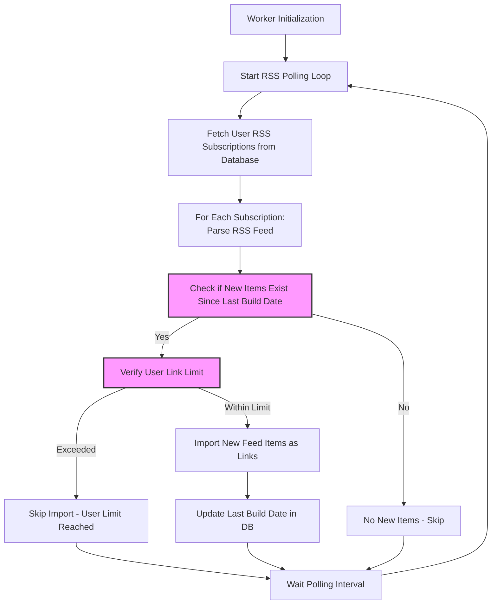

# RSS Feeds API

Programmatically manage your RSS feed subscriptions to automate importing and preserving external content within Linkwarden. This API enables seamless integration of news, alerts, research updates, or any regularly updated feeds directly into your Linkwarden bookmarking and archival workflows, maintaining your curated links fresh and organized without manual effort.

---

## Overview

The RSS Feeds API allows users to create, retrieve, and delete RSS feed subscriptions associated with their Linkwarden account. Each RSS subscription monitors an external RSS feed URL, periodically polling it for new items and automatically importing those items as bookmarks within the user's designated Linkwarden collection.

This automation enriches your Linkwarden library by continuously ingesting external content updates, saving you time and helping you capture timely information from your favorite feeds.

---

## Key Concepts

- **RSS Subscription**: A user-defined configuration that specifies an RSS feed URL to be polled regularly.
- **Polling Interval**: The system polls all active subscriptions at a configured frequency (default 60 minutes).
- **Feed Items**: New entries detected since the last poll are imported as bookmarks (links) into the specified collection.
- **Collections**: Groups of links/bookmarks within Linkwarden where imported RSS feed items are stored.

---

## Authentication & Authorization

All RSS Feeds API endpoints require authentication via the user's session credentials. Only the authenticated user can manage their own RSS subscriptions.

Permission enforcement ensures users can only add feeds to collections they have access to and can only delete their own subscriptions.

---

## Endpoints

### Retrieve RSS Subscriptions

- **Method:** GET
- **URL:** `/api/v1/rss`

Fetches all RSS feed subscriptions belonging to the authenticated user, including the name of each associated collection.

#### Response
```json
{
  "response": [
    {
      "id": 123,
      "name": "Tech News",
      "url": "https://example.com/rss",
      "ownerId": "user-uuid",
      "collection": {
        "name": "Technology"
      },
      "lastBuildDate": "2024-05-15T12:34:56.789Z"
    },
    ...
  ]
}
```


### Add a New RSS Subscription

- **Method:** POST
- **URL:** `/api/v1/rss`
- **Body Parameters:**
  - `name` (string, required): A unique identifier for your subscription.
  - `url` (string, required): The RSS feed URL.
  - `collectionId` or `collectionName` (integer or string, required): Target collection to store imported links.


#### Constraints & Validations
- Each user has a maximum subscription limit, default 20.
- The `name` must be unique per user.
- The collection must be accessible by the user or created if a new collection name is provided.

#### Example Request
```http
POST /api/v1/rss
Content-Type: application/json

{
  "name": "My Favorite Blog",
  "url": "https://myblog.com/rss",
  "collectionName": "Blogs"
}
```

#### Successful Response
```json
{
  "response": {
    "id": 456,
    "name": "My Favorite Blog",
    "url": "https://myblog.com/rss",
    "ownerId": "user-uuid",
    "collection": {
      "name": "Blogs"
    },
    "lastBuildDate": null
  }
}
```

Upon creation, the API immediately fetches and imports the latest feed items.


### Delete an RSS Subscription

- **Method:** DELETE
- **URL:** `/api/v1/rss/{id}`

Deletes the specified RSS subscription if owned by the authenticated user.

#### Example Request
```http
DELETE /api/v1/rss/456
```

#### Successful Response
```json
{
  "response": "RSS subscription deleted."
}
```


---

## How RSS Polling Works

The system automatically polls all existing RSS subscriptions at a configurable interval (default 60 minutes).

At each polling cycle:

1. The RSS feed is fetched and parsed.
2. The latest feed's `lastBuildDate` or the most recent item's `pubDate` is determined.
3. If new items have been published since the last import, those items are filtered.
4. Linkwarden checks if the user’s link storage limit allows importing all new items.
5. Each new item is imported as a bookmark link in the targeted collection.
6. The subscription's `lastBuildDate` is updated to reflect the newest feed date imported.

This continuous loop maintains up-to-date bookmarks from all feeds a user subscribes to.

<Tip>
The polling interval can be adjusted with the environment variable `NEXT_PUBLIC_RSS_POLLING_INTERVAL_MINUTES`. By default, it is set to 60 minutes.
</Tip>

---

## Data Model

### RSS Subscription Object

| Field           | Type       | Description                                    |
|-----------------|------------|------------------------------------------------|
| id              | integer    | Unique identifier of the subscription          |
| name            | string     | User-defined name for the subscription         |
| url             | string     | RSS feed URL                                   |
| ownerId         | UUID       | The user who owns this subscription             |
| collectionId    | integer    | The target collection's ID for imported links  |
| lastBuildDate   | DateTime?  | Timestamp of the last successful feed import   |

---

## Practical Usage Examples

### Add RSS Subscription Example (cURL)
```bash
curl -X POST https://yourlinkwardeninstance.com/api/v1/rss \
  -H "Content-Type: application/json" \
  -b "your_session_cookie" \
  -d '{
    "name": "Daily Tech Updates",
    "url": "https://technews.com/rss",
    "collectionName": "Tech"
}'
```

### List RSS Subscriptions Example (JavaScript)
```javascript
import fetch from 'node-fetch';

async function getRssSubscriptions() {
  const response = await fetch('/api/v1/rss', { credentials: 'include' });

  if (!response.ok) throw new Error('Failed to get subscriptions');

  const data = await response.json();
  return data.response;
}

getRssSubscriptions().then(subs => console.log(subs));
```

---

## Troubleshooting

### Common Issues & Solutions

- **RSS Feed URL Invalid or Unreachable:**
  - Ensure the URL is a valid RSS feed and publicly accessible.
  - Confirm there are no network or firewall blocks.
- **Duplicate Subscription Name:**
  - Use a unique name within your account for each subscription.
- **Subscription Limit Exceeded:**
  - Remove unused subscriptions or contact support to increase your limit.
- **Item Import Skipped Due to Link Limits:**
  - If you have too many stored links, new RSS items will not be imported until space is freed.
- **Polling Delays:**
  - Polling occurs at fixed intervals; new items may appear with delay based on configuration.

### Error Logging

Errors during RSS feed processing appear in the workers’ logs for diagnostics.

---

## Best Practices

- Choose meaningful, descriptive names for your subscriptions for easy management.
- Organize imported feed items by assigning them to the appropriate collection.
- Regularly review and clean old or unused RSS subscriptions.
- Monitor link limits to prevent skipping new feed imports.

---

## Behind the Scenes: Worker Polling Flow



---

## Related Documentation

- [Links (Bookmarks) API](/api-reference/core-workflows/bookmarks-links-api) – Manage imported feed items as bookmarks
- [Collections API](/api-reference/core-workflows/collections-api) – Organize feed items into collections
- [Authentication & Authorization](/api-reference/core-workflows/authentication-authorization) – Secure API access
- [User Accounts API](/api-reference/core-workflows/user-accounts-api) – Manage user profile and quotas
- [RSS Feeds UI Settings](apps/web/pages/settings/rss-subscriptions.tsx) – Manage subscriptions via the web interface

---

## Next Steps

- Explore the RSS Feeds API with real requests to automate your favorite content streams.
- Use the web app's RSS Subscriptions settings to visually manage your feeds.
- Combine RSS feeds with Linkwarden’s rich bookmarking and archival features to preserve and organize external content effortlessly.
- Review best practices around link limits and collection organization to maintain a healthy database.

---