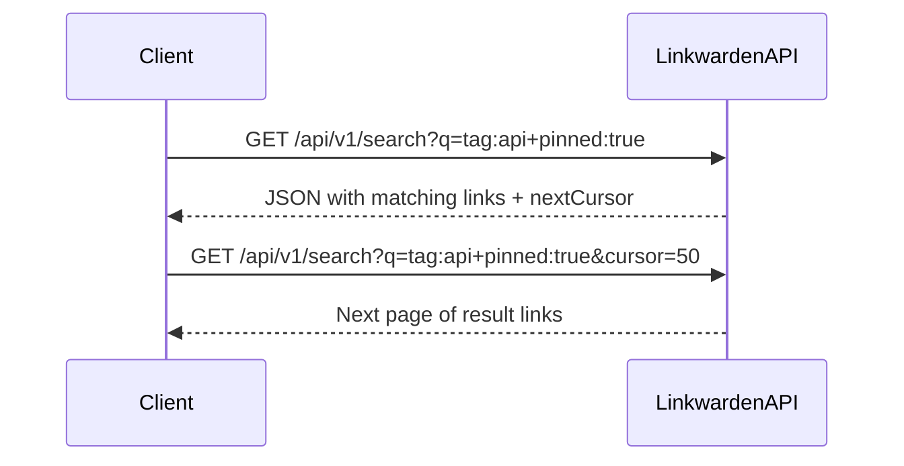

# Search API Reference

Leverage the Linkwarden Search API to perform powerful full-text searches across your bookmarks, highlights, tags, and collections. This API enables filtering, sorting, and pagination of search results, empowering you to integrate rich discovery capabilities into your workflows and applications.

---

## 1. Overview

The Search API is designed to help you quickly find relevant links and related resources saved in your Linkwarden account or public collections. It combines full-text search capabilities with advanced filtering to tailor results to exactly what you need.

- **Endpoint:** `/api/v1/search`
- **Method:** `GET`
- **Authentication:** Required (User session token or API token)
- **Response Format:** JSON

### Key capabilities:

- Search across multiple link fields: URL, name, description, tags, collection names.
- Use search modifiers and filters to scope results.
- Sort results by creation date or alphabetically.
- Paginate through large result sets with cursors.
- Query both private user data and public collections.

---

## 2. Authentication & Access

All search requests require valid user authentication unless querying public collections explicitly:

- **Authenticated Search:** Returns results from the authenticated user's accessible collections.
- **Public Search:** Returns results only from publicly shared collections.

Provide the authorization token via the `Authorization: Bearer <token>` HTTP header.

<Check>
Ensure your application handles authentication tokens securely and refreshes them as needed to avoid unauthorized errors.
</Check>

---

## 3. Endpoint: Search Links

### HTTP Request

```http
GET /api/v1/search
Authorization: Bearer <token>
Content-Type: application/json
```

### Query Parameters

| Parameter           | Type    | Description                                                                                                     | Optional/Required |
|---------------------|---------|---------------------------------------------------------------------------------------------------------------|------------------|
| `q` / `searchQueryString` | string  | The full-text search query string, supporting keywords and filters (see Search Query Syntax).                  | Optional         |
| `sort`              | integer | Sort order key: 
 - `0` or `DateNewestFirst` (default)
 - `1` or `DateOldestFirst`
 - `2` or `NameAZ`
 - `3` or `NameZA` | Optional         |
| `cursor`            | integer | Cursor offset for pagination. Use the `nextCursor` value from previous results to paginate.                    | Optional         |
| `collectionId`      | integer | Filter search to a specific collection by its ID.                                                              | Optional         |
| `tagId`             | integer | Filter search results to links tagged with the specified tag ID.                                              | Optional         |
| `pinnedOnly`        | boolean | If `true`, only returns links the user has pinned.                                                            | Optional         |

### Description

Searches through your links using full-text search augmented with field-specific filters. Supports both broad and refined queries to yield precise results.

---

## 4. Search Query Syntax

Search queries support plain text and field-specific filters in the format `{field}:{value}`. Negation is supported with a leading exclamation mark `!`.

### Supported Fields

- `url` — Search within link URLs
- `name` — Link title or name
- `description` — Description of the link
- `type` — Link type
- `collection` — Collection name
- `pinned` — Filter pinned state (`true` or `false`)
- `public` — Match links in public collections (`true` only)
- `before` — Links created before a date (`YYYY-MM-DD` or ISO format)
- `after` — Links created after a date
- `tag` — Search links with a specific tag

### Examples

- `javascript` — Search all links containing “javascript” in general fields
- `name:React` — Search links where name contains “React”
- `!tag:deprecated` — Exclude links tagged “deprecated”
- `collection:Work pinned:true` — Search pinned links in the “Work” collection
- `before:2023-01-01` — Search links created before January 1, 2023

<Info>
Field filters are case-insensitive and can be combined to narrow results.
</Info>

---

## 5. Response Structure

### Successful Response

```json
{
  "success": true,
  "message": "Success",
  "data": {
    "links": [
      {
        "id": 123,
        "url": "https://example.com",
        "name": "Example Site",
        "description": "A useful resource",
        "type": "url",
        "collection": {
          "id": 45,
          "name": "Research"
        },
        "tags": [
          { "id": 7, "name": "documentation" },
          { "id": 8, "name": "api" }
        ],
        "pinnedBy": [
          { "id": 2 }
        ]
      }
      // More links...
    ],
    "nextCursor": 50
  },
  "statusCode": 200
}
```

#### Fields

- `links` — Array of matching link objects including tags, collection, and pin info
- `nextCursor` — Cursor value to request the next page of results, or `null` if no more results

### Error Responses

| HTTP Status | Response Example                                  | Meaning                               |
|-------------|-------------------------------------------------|-------------------------------------|
| 401         | `{ "response": "Unauthorized" }`             | Missing or invalid authentication   |
| 400         | `{ "response": "Invalid query parameters" }`| Invalid or malformed parameters      |
| 500         | `{ "response": "Internal server error" }`   | Server-side failure                  |

---

## 6. Pagination

The Search API paginates results using a numeric `cursor` offset.

- Initial request: no `cursor` or `cursor=0`
- Subsequent requests: use the `nextCursor` from the previous response
- When `nextCursor` is `null`, there are no more results

This mechanism ensures efficient retrieval over large datasets.

---

## 7. Sorting Options

You can control the order of results with the `sort` parameter:

| Sort Value             | Description           |
|------------------------|-----------------------|
| `0` or `DateNewestFirst` | Newest links first     |
| `1` or `DateOldestFirst` | Oldest links first     |
| `2` or `NameAZ`          | Alphabetical A-Z       |
| `3` or `NameZA`          | Alphabetical Z-A       |

Sorting applies before pagination.

---

## 8. Practical Usage Examples

### Example 1: Basic Search for Links Containing 'React'

```http
GET /api/v1/search?searchQueryString=React HTTP/1.1
Authorization: Bearer <token>
```

Returns links with 'React' in name, URL, description, or tags.

### Example 2: Search Pinned Links in a Specific Collection

```http
GET /api/v1/search?collectionId=45&pinnedOnly=true HTTP/1.1
Authorization: Bearer <token>
```

Retrieves all links pinned by the user within collection ID 45.

### Example 3: Exclude Tag and Filter by Date

```http
GET /api/v1/search?searchQueryString=!tag:deprecated after:2023-01-01 HTTP/1.1
Authorization: Bearer <token>
```

Finds links not tagged "deprecated" and added after January 1, 2023.

---

## 9. Best Practices & Tips

- **Use filters to narrow searches:** Combine fields such as tags, collection, pinned status, and date to get precise results.
- **Avoid overly broad queries:** Long or vague queries may return excessive data and reduce performance.
- **Leverage pagination for large datasets:** Always check and use `nextCursor` to iterate through results.
- **Secure your tokens:** Never expose your authentication tokens in client-side code or logs.

<Warning>
Incorrect or expired tokens will result in authorization errors. Handle 401 status responses gracefully in your client.
</Warning>

---

## 10. Troubleshooting

| Symptom                      | Cause                                    | Solution                                |
|------------------------------|------------------------------------------|----------------------------------------|
| Empty results unexpected      | Query syntax too restrictive or no matches| Simplify query or verify search terms. |
| 401 Unauthorized errors       | Missing/invalid token                     | Verify and refresh authentication tokens.
| 400 Bad Request               | Invalid query parameters                  | Check parameter names and values.
| Slow search response          | Large dataset or complex query            | Use filters and pagination.

---

## 11. Integration Flow

The typical user flow for integrating the Search API is:

1. **Authenticate** user and obtain a token.
2. **Construct** a search query string with filters.
3. **Send** a GET request to `/api/v1/search` with query and sort parameters.
4. **Process** JSON response to display or use links.
5. **Paginate** using `nextCursor` as needed.



---

## 12. Related Documentation

- [Authentication & Authorization](https://linkwarden.com/api-reference/core-workflows/authentication-authorization)
- [Links (Bookmarks) API](https://linkwarden.com/api-reference/core-workflows/bookmarks-links-api)
- [Tags API](https://linkwarden.com/api-reference/core-workflows/tags-api)
- [Collections API](https://linkwarden.com/api-reference/core-workflows/collections-api)
- [Error Handling & Status Codes](https://linkwarden.com/api-reference/api-usage-guides/error-handling-status-codes)

---

By mastering the Search API, you will enhance your ability to quickly and efficiently discover the content most valuable in your Linkwarden instance or public collections, unlocking the full power of your saved resources.

---