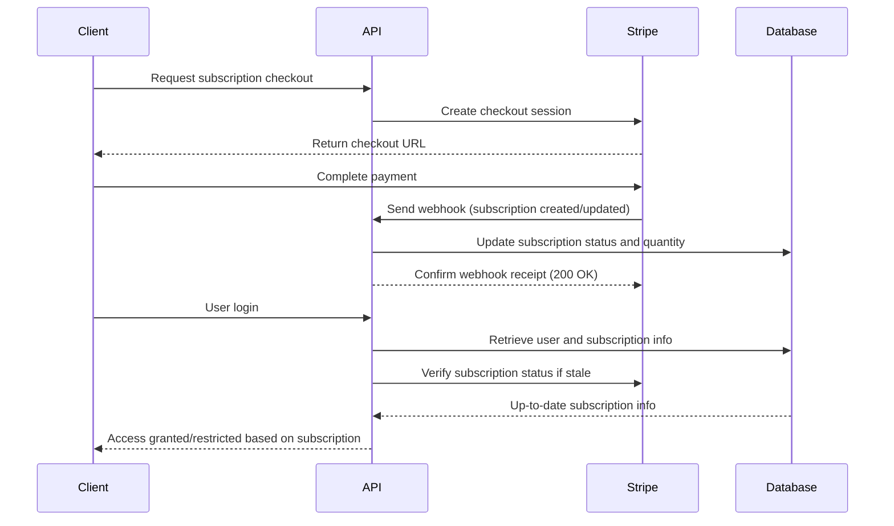

# Subscriptions & Billing API

Manage user subscriptions, seat allocations, and billing integration using Stripe. This set of endpoints and operations empowers you to automate subscription provisioning, track subscription status, manage billing seats, and keep user access in sync with their payment status.

---

## Overview

The Subscriptions & Billing API enables you to:

- Verify if a user is an active subscriber
- Update subscription details including active status and seat quantity
- Manage seat allocation dynamically for teams or organizations
- Facilitate subscription-related webhooks from Stripe
- Handle user email updates tied to billing records
- Perform smooth checkout session creation for new subscriptions

These endpoints are the backbone for integrating Linkwarden with your organizational billing and entitlement system, automating user access and billing adjustments in real time.

---

## Key Concepts

- **Subscription**: A record tied to a single user representing their payment for access tiers, managed through Stripe.
- **Seats**: The quantity parameter in Stripe representing allowed user seats in an organization/subscription.
- **Active Status**: Defines whether the subscription is currently valid or expired.
- **Parent Subscription**: Relates to organizational seats under a primary subscription, allowing managed seat updates.
- **Stripe Webhook Events**: Stripe sends events such as subscription creation, updates, and deletions to sync billing state.

---

## Base URL

All endpoints are hosted under Linkwarden's secure API domain. Since some functionality is integrated through Next.js API routes (e.g., webhook, authentication), endpoints are exposed as such:

```
/api/v1/...
```

For example, the webhook endpoint listens at `/api/v1/webhook/`.

---

## Authentication & Authorization

All subscription-related API interactions require authenticated users with proper access tokens.

- User identity validation incorporates token verification and subscription checks.
- Non-subscribers receive appropriate HTTP 401 responses preventing access.

Token management and sign-in flows are documented thoroughly in the [Authentication & Authorization](https://linkwarden.com/api-reference/core-workflows/authentication-authorization) section.

---

## API Endpoints

### Stripe Webhook Endpoint

**POST** `/api/v1/webhook/`

This endpoint listens for Stripe events specifically related to subscriptions. Supported event types:

- `customer.subscription.created`
- `customer.subscription.updated`
- `customer.subscription.deleted`

**Behavior:**

- Validates Stripe webhook signature
- Updates or creates subscription data in the database
- Synchronizes subscription status, seat quantities, and billing cycle timestamps

**Success Response:**

- HTTP 200 with JSON `{ response: 'Done!' }`

**Error Handling:**

- HTTP 400 for missing Stripe keys or webhook secret
- HTTP 400 for failed signature verification
- HTTP 500 on internal errors processing events

---

### Verify Subscription Status

This is handled by internal API functions invoked during user verification and session creation but can be queried programmatically.

**Function:** `verifySubscription(user)`

- Returns the updated user object if there's an active subscription
- Returns `null` if no active subscription or if user subscription expired

This function internally checks Stripe data via customer email, updates local records, and ensures that user access aligns precisely with billing state.

---

### Update Seats in Subscription

Use this to dynamically adjust the seats (quantity) associated with a subscription.

**Function:** `updateSeats(subscriptionId: string, seats: number)`

- Updates the Stripe subscription quantity
- Proration behavior considers trial status (only sets immediate proration if not trialing)

**Use Case:** Automatically add or remove seats based on verified user count in an organization.

---

### Update Customer Email in Stripe

Used when a user updates their email address to keep Stripe customer records and billing in sync.

**Function:** `updateCustomerEmail(stripeSecretKey: string, oldEmail: string, newEmail: string)`

- Finds the Stripe customer by old email
- Checks for valid active subscriptions
- Updates the customer record with the new email

---

### Payment Checkout Session

Initiate a Stripe Checkout session to start or renew a subscription.

**Function:** `paymentCheckout(stripeSecretKey: string, email: string, priceId: string)`

- Checks if the user already has an active subscription to avoid duplicates
- Creates a new Stripe Checkout session with trial period
- Returns a URL to redirect the user for payment

---

## Practical Usage Examples

### Handle Stripe Webhook Event (Subscription Created)

```javascript
// Example webhook event processing snippet
await handleSubscription({
  id: 'sub_12345',
  active: true,
  quantity: 5,
  periodStart: 1680000000, // timestamp in seconds
  periodEnd: 1682592000,
  action: 'customer.subscription.created',
});
```

This updates the subscription record or creates it if missing, linking to the user via email.

---

### Verify User Subscription Status

```javascript
import verifySubscription from './stripe/verifySubscription';

const user = await prisma.user.findUnique({
  where: { email: 'user@example.com' },
  include: { subscriptions: true, parentSubscription: true },
});

const subscribedUser = await verifySubscription(user);

if (!subscribedUser) {
  // Handle unauthorized or subscription-expired logic
}
```

---

### Updating Seats After Adding a New Team Member

```javascript
import updateSeats from './stripe/updateSeats';

const parentSubscriptionId = 'sub_12345';
const newSeatCount = 10; // Updated count of seats
await updateSeats(parentSubscriptionId, newSeatCount);
```

This call adjusts the seat quantity on Stripe to reflect actual users.

---

### Initiate a New Subscription Checkout

```javascript
import paymentCheckout from './paymentCheckout';

const stripeSecretKey = process.env.STRIPE_SECRET_KEY;
const email = 'newuser@example.com';
const priceId = 'price_abc123';

const { response: checkoutUrl, status } = await paymentCheckout(stripeSecretKey, email, priceId);

if (status === 200) {
  // Redirect user to checkoutUrl for payment
}
```

---

## Best Practices & Recommendations

- Always verify the user's subscription status on each login or privileged API call to ensure entitlement matches payment.
- Use the webhook endpoint to keep subscription state in real time—avoid relying solely on periodic polling.
- When scaling team seats, update the subscription quantity immediately to reflect the true seat count to prevent payment discrepancies.
- Handle email updates carefully to keep user billing synchronized across Linkwarden and Stripe.
- Apply rate limiting on sensitive workflow endpoints such as email verification and webhook handling.

---

## Common Pitfalls & Troubleshooting

<AccordionGroup title="Troubleshooting Common Issues">
<Accordion title="Webhook Signature Verification Failed">
Ensure that your Stripe webhook secret is correctly set in your environment variables (`STRIPE_WEBHOOK_SECRET`). Also, confirm that the raw request body is passed during verification as per Stripe's webhook requirements.
</Accordion>
<Accordion title="Subscription Status Not Updated After Payment">
Check that webhook events are arriving and processing correctly. The endpoint must respond with HTTP 200 within Stripe's timeout window. Monitor logs for errors during subscription handling.
</Accordion>
<Accordion title="Seat Count Mismatch in Stripe vs. Users">
Verify that `updateSeats` is called whenever a user with subscription entitlement is added or removed. Seats must be incremented to accommodate all active users under a subscription.
</Accordion>
<Accordion title="User Email Change Not Reflected in Billing">
Ensure that the endpoint handling email verification calls the `updateCustomerEmail` function with correct old and new addresses. Stripe requires explicit API calls to update customer records.
</Accordion>
</AccordionGroup>

---

## Data Models & Schemas

### Subscription Object

| Field               | Type     | Description                                     |
|---------------------|----------|------------------------------------------------|
| id                  | string   | Internal database subscription ID              |
| stripeSubscriptionId| string   | Stripe subscription identifier                  |
| active              | boolean  | Is the subscription currently active?           |
| quantity            | number   | Number of seats allocated                        |
| currentPeriodStart  | Date     | Subscription period start date                   |
| currentPeriodEnd    | Date     | Subscription period end date                     |
| userId              | string   | Reference to the associated user                 |


### User Object (Relevant Fields)

| Field               | Type     | Description                                     |
|---------------------|----------|------------------------------------------------|
| id                  | string   | Unique user ID                                  |
| email               | string   | User's email address                            |
| subscriptions       | Subscription|null | User's own subscription record                 |
| parentSubscription  | Subscription|null | Reference to parent subscription if child user |

---

## Security Considerations

- Store Stripe secret keys securely and restrict access.
- Validate all incoming webhook events via Stripe signature verification.
- Use secure authentication tokens when calling these API functions.
- Enforce rate limits and audit logs for subscription and billing API calls.

---

## Integration Flow Overview



---

For deeper insight into authentication, user management, and API token usage, consult the following related documentation pages:

- [Authentication & Authorization](https://linkwarden.com/api-reference/core-workflows/authentication-authorization)
- [User Accounts API](https://linkwarden.com/api-reference/core-workflows/user-accounts-api)
- [API Keys & Tokens](https://linkwarden.com/api-reference/advanced-features/tokens-and-api-keys)

---

By aligning your application with these APIs and best practices, you unlock seamless subscription management that scales securely with your users and organizational needs.

---

_End of Subscriptions & Billing API Documentation._