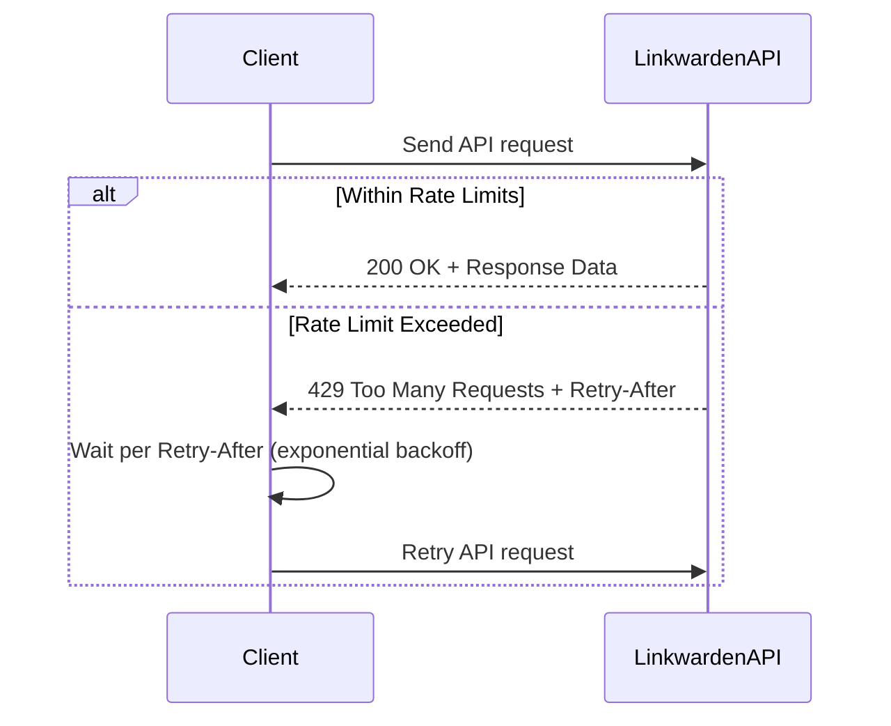

# Rate Limiting & Quotas

Linkwarden's API is designed to support seamless and scalable integration with your workflows while ensuring reliable service availability and fair usage for all users. This page explains how Linkwarden manages **API rate limits, quotas,** and **throttling**, and guides you on designing your API consumers with resilience mechanisms like **exponential backoff** and **retry logic**.

---

## Understanding Rate Limits and Quotas

### What Are Rate Limits?
Rate limits define the maximum number of API requests a client can make within a specified time window. They prevent overwhelming the system and ensure fair resource usage across all users.

### What Are Quotas?
Quotas represent longer-term consumption limits, such as total requests per day or month, often tied to subscription plans or user tiers. Quotas manage overall usage to balance capacity and subscription entitlements.

### Why Does Linkwarden Enforce Them?
- Safeguard system stability under heavy load
- Prevent abuse or excessive resource consumption
- Maintain fair access for all users

---

## How Linkwarden Applies Rate Limits

- **Per-user basis:** Limits apply individually to authenticated users or API tokens.
- **Burst control:** Short-term bursts are controlled to avoid sudden overloads.
- **Dynamic adjustments:** Limits may vary depending on subscription plans and current system load.

**Typical constraints include:**
- Maximum number of requests per minute
- Maximum concurrent connections
- Request size limits

---

## Identifying Rate Limit Responses

When you exceed rate limits, the API will respond with an HTTP status code:

| Status Code | Meaning                        |
|-------------|--------------------------------|
| `429 Too Many Requests` | Request count exceeded.       |

The response will also include headers to guide your retry timing:

| Header Name           | Purpose                                 |
|-----------------------|----------------------------------------|
| `Retry-After`         | Number of seconds to wait before retry |

---

## Best Practices for API Consumers

To design applications that handle rate limiting gracefully, follow these guidelines:

### 1. Implement Exponential Backoff with Jitter

Avoid hammering the API after a 429 response by backing off exponentially before retrying, adding randomness to reduce synchronized retries:

```javascript
async function wait(ms) {
  return new Promise((resolve) => setTimeout(resolve, ms));
}

async function retryWithBackoff(operation, maxRetries = 5) {
  let attempt = 0;
  while (attempt < maxRetries) {
    try {
      return await operation();
    } catch (error) {
      if (error.status === 429) {
        // Calculate exponential backoff with jitter
        const baseDelay = Math.pow(2, attempt) * 1000; // millis
        const jitter = Math.random() * 1000; // add up to 1s random
        const delay = baseDelay + jitter;
        console.warn(`Rate limited. Retrying in ${Math.round(delay)} ms`);
        await wait(delay);
        attempt++;
      } else {
        throw error; // Other errors propagate
      }
    }
  }
  throw new Error('Max retries exceeded due to rate limits.');
}
```

### 2. Respect `Retry-After` Header
If the API provides a `Retry-After` header, use its value to determine your next retry timing precisely.

### 3. Monitor Your Usage
Log and monitor how often you hit rate limits to adjust your call frequency. Consider spreading bulk operations over time.

### 4. Cache Responses When Appropriate
Minimize unnecessary requests by caching frequent calls or using webhooks/events if supported.

### 5. Use Efficient Requests
- Request only needed fields
- Avoid polls with very short intervals
- Use filtering and pagination to reduce data volume

---

## Handling API Quotas

For users with quota-based limits (e.g., monthly API call allowance), consider:

- Tracking your quota consumption if the API supports it or via usage dashboards
- Distributing API calls over time rather than batch bursts
- Upgrading subscription or contacting support if quotas are regularly reached

---

## Common Pitfalls & Troubleshooting

| Issue                              | Cause                                       | Solution                                         |
|----------------------------------|---------------------------------------------|-------------------------------------------------|
| Frequent 429 errors               | Making requests too quickly                   | Implement/exponential backoff and timing respect |
| Ignoring `Retry-After` header    | Immediate retries despite server advice      | Always wait according to `Retry-After`          |
| Inconsistent rate limit handling | No retry logic or error handling in client  | Add robust error detection and retry            |
| Overloading during bulk imports  | Sending large batch requests all at once     | Throttle requests, use queues or background jobs |

---

## Designing for Compliance

Linkwarden expects API integrations to be respectful of these limits to provide a fair experience for everyone. Abusive or excessive usage may lead to temporary or permanent blocking.

Always:
- Build retry and fallback mechanisms
- Keep calls as efficient as possible
- Check API usage documentation regularly for any updates

---

## Summary

By understanding and respecting Linkwarden's rate limits and quotas, you ensure your application remains reliable and efficient. Implement exponential backoff with jitter and monitor your usage proactively to avoid disruptions. Take advantage of response headers and error codes to design resilient clients.

---

## Additional Resources

- [Authentication & Authorization](https://linkwarden.com/api-reference/core-workflows/authentication-authorization) — Learn about securing your API usage.
- [Error Handling & Status Codes](https://linkwarden.com/api-reference/api-usage-guides/error-handling-status-codes) — Understand how to interpret API errors.
- [API Keys & Tokens](https://linkwarden.com/api-reference/advanced-features/tokens-and-api-keys) — Manage your programmatic access securely.
- [API Automation Guide](https://linkwarden.com/guides/advanced-usage-integrations/api-automation) — Practical usage and integration patterns.

<Info>
Keep your integration healthy and scalable by designing around these operational constraints – your users and Linkwarden will thank you.
</Info>

---

## Example: Handling Rate Limits in Fetch API

```javascript
async function fetchWithRateLimit(url, options = {}, retries = 5) {
  for (let i = 0; i < retries; i++) {
    const response = await fetch(url, options);
    if (response.status === 429) {
      const retryAfter = response.headers.get('Retry-After');
      const delay = retryAfter ? Number(retryAfter) * 1000 : Math.pow(2, i) * 1000;
      console.warn(`Rate limited. Retrying after ${delay} ms`);
      await new Promise((resolve) => setTimeout(resolve, delay));
    } else {
      if (!response.ok) {
        throw new Error(`Request failed with status ${response.status}`);
      }
      return response.json();
    }
  }
  throw new Error('Exceeded maximum retries due to rate limiting');
}
```

Use this pattern to help maintain smooth API consumption.

---

## Diagram: API Client Request Flow with Rate Limiting

