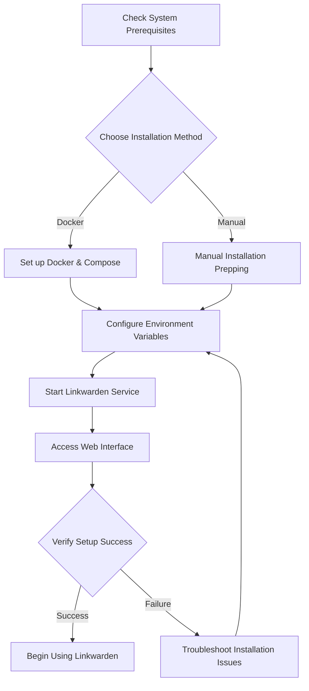

# Installing Linkwarden

Get Linkwarden up and running quickly and reliably with this step-by-step deployment guide. Whether you choose Docker-based container deployment or prefer a manual installation, this guide walks you through essential prerequisites, installation actions, and initial verification procedures, setting you on a path to a smooth and stable Linkwarden experience.

---

## 1. System Prerequisites

Before installing Linkwarden, ensure your environment meets these requirements to guarantee optimal performance and compatibility.

### Supported Platforms
- Linux distributions (Ubuntu, Debian, CentOS, etc.)
- macOS
- Windows (via WSL or Docker Desktop)

### Hardware Requirements
- CPU: Minimum 2 cores recommended for moderate usage
- Memory: At least 4GB RAM; more for larger user bases or heavy archival use
- Storage: Minimum 20GB free disk space; archival features (PDFs, screenshots) increase storage needs over time

### Software Requirements
- Docker (Community Edition) version 20.10 or later for container deployment
- Docker Compose version 1.29 or later
- Node.js (for manual installation), version 18 or above
- Database: PostgreSQL 13+ (if self-hosting database separately)
- Internet connectivity for optional integrations like Wayback Machine archival

### Network and Security
- Open ports: TCP 80 (HTTP) and/or 443 (HTTPS) for web access
- Reverse proxy or load balancer configured if applicable
- SSL/TLS certificates for secure HTTPS communication (recommended)

<Tip>
For best security and performance, deploy Linkwarden behind a reverse proxy such as Nginx or Traefik and enable HTTPS using Let's Encrypt.
</Tip>

---

## 2. Installation Methods

There are two primary ways to install Linkwarden: via Docker containers for simplicity and isolation, or manual installation for custom environments. Choose the method that best fits your infrastructure.

### 2.1 Docker-Based Installation

Docker offers an isolated, repeatable, and easy-to-manage environment for Linkwarden.

#### Step-by-Step:
1. **Install Docker and Docker Compose**
   - Follow installation guides for your OS at [Docker official docs](https://docs.docker.com/get-docker/).
2. **Clone the Linkwarden Repository**

```bash
git clone https://github.com/linkwarden/linkwarden.git
cd linkwarden
```

3. **Prepare Environment Variables**
   - Copy `.env.sample` to `.env`
   - Customize variables such as database connection, service URLs, and optional features.

```bash
cp .env.sample .env
```

4. **Start Containers**

```bash
docker-compose up -d
```

5. **Verify Running Containers**

```bash
docker ps
```

6. **Access Linkwarden**
- Open your browser and navigate to the server's URL on port 80 or 443.

<Tip>
Modify the `.env` file to enable or disable features such as screenshot capture, PDF archival, AI tagging, and integrations.
</Tip>

### 2.2 Manual Installation

For environments without container support or for advanced customization, a manual install is recommended.

#### Prerequisites:
- Node.js 18+
- PostgreSQL database configured and accessible
- Required system dependencies such as `libpng`, `libjpeg`, `ffmpeg` for archival processing

#### Steps:
1. **Clone Linkwarden Repository**

```bash
git clone https://github.com/linkwarden/linkwarden.git
cd linkwarden
```

2. **Install Dependencies**

```bash
npm install
```

3. **Configure Environment Variables**
- Copy `.env.sample` to `.env` and configure database connection strings, ports, secrets, and feature flags.

4. **Set Up Database**
- Run migrations to set up the database schema.

```bash
npx prisma migrate deploy
```

5. **Build the Application**

```bash
npm run build
```

6. **Start the Server**

```bash
npm start
```

7. **Confirm Access**
- Visit your Linkwarden instance through the web browser at your configured host and port.

<Warning>
Ensure environment variables for database connectivity and secrets are accurate to avoid failures during startup.
</Warning>

---

## 3. Post-Installation Verification and Initial Setup

After installation, confirm that Linkwarden is fully operational with these verification and validation steps.

### 3.1 Check Web Interface Availability
- Open the Linkwarden URL.
- The welcome or login page should load quickly without error.

### 3.2 Backend Health Check
- If using Docker, inspect logs:

```bash
docker-compose logs -f
```

- Look for errors indicating database connectivity or service failures.

### 3.3 Database Connectivity Verification
- Confirm database connections are active and migrations have been applied.
- In manual setups, verify via logs or direct database queries.

### 3.4 Authentication Setup
- Create an initial account if self-hosted, or proceed with cloud login flow.
- Follow [Account Setup and First Login](https://docs.linkwarden.app/getting-started/configuration-initial-setup/account-setup-login) for assistance.

### 3.5 Importing Bookmarks (Optional)
- Use the Import feature to migrate bookmarks from other services or backups.
- Supported formats include:
  - Linkwarden JSON
  - HTML files
  - Pocket CSV
  - Wallabag JSON
  - Omnivore ZIP

See the [Importing, Exporting, and Migrating Bookmarks](https://docs.linkwarden.app/guides/advanced-usage-integrations/import-export-migration) guide for detailed instructions.

### 3.6 Initial Backup and Archival Testing
- Save your first bookmark to trigger automatic archival (screenshots, PDFs).
- Confirm these assets generate correctly.

---

## 4. Troubleshooting Common Installation Issues

Despite preparation, some issues may arise during installation or startup. Here’s how to identify and solve typical problems.

<AccordionGroup title="Troubleshooting Installation">
<Accordion title="Docker Container Fails to Start">
- Check container logs for error messages (`docker logs <container_id>`).
- Verify `.env` variables, especially database URLs and secrets.
- Confirm Docker daemon is running and has sufficient resources.
</Accordion>

<Accordion title="Application Cannot Connect to Database">
- Ensure PostgreSQL is running and accessible.
- Double-check host, port, username, and password in environment variables.
- Confirm database user has appropriate permissions.
- Use tools like `psql` to test connectivity.
</Accordion>

<Accordion title="Archival Features Not Working">
- Confirm dependencies like `puppeteer`, image libraries, and headless browser binaries are installed.
- Verify environment flags enabling PDF and screenshot capturing.
- Check logs for errors related to archival jobs.
</Accordion>

<Accordion title="Web Interface Is Unresponsive or Slow">
- Check system resource utilization (CPU, Memory, Disk I/O).
- Confirm database performance and slow queries.
- Consider enabling caching layers or scaling the deployment.
</Accordion>

<Accordion title="Initial Login Fails or Authentication Issues">
- Reset passwords if self-hosted.
- Verify email templates and delivery if using email verification.
- Reference [Authentication & Access Issues](https://docs.linkwarden.app/getting-started/troubleshooting-faq/authentication-issues) for detailed help.
</Accordion>
</AccordionGroup>

---

## 5. Best Practices for a Healthy Deployment

- Regularly backup your database and archive storage.
- Monitor system logs and set up alerts for service downtime.
- Keep Linkwarden, Docker, and dependencies up to date.
- Use SSL/TLS and strong authentication for remote access.
- Leverage community and official support channels if issues persist.

---

For more detailed operational management and scaling strategies, visit the [Deployment Overview](https://docs.linkwarden.app/deployment/getting-started-deployment/deployment-overview) and [Monitoring and Logging](https://docs.linkwarden.app/deployment/operational-management/monitoring-logging) guides.

---

# Summary Diagram: High-Level Deployment Flow


---

## Related Documentation

- [System Requirements](https://docs.linkwarden.app/getting-started/requirements-installation/system-requirements)
- [Choosing Your Deployment: Cloud vs. Self-Hosted](https://docs.linkwarden.app/getting-started/requirements-installation/choosing-your-deployment)
- [Self-Hosted Installation](https://docs.linkwarden.app/getting-started/requirements-installation/self-hosted-installation)
- [Environment Configuration](https://docs.linkwarden.app/getting-started/configuration-initial-setup/environment-configuration)
- [Account Setup and First Login](https://docs.linkwarden.app/getting-started/configuration-initial-setup/account-setup-login)
- [Importing, Exporting, and Migrating Bookmarks](https://docs.linkwarden.app/guides/advanced-usage-integrations/import-export-migration)
- [Troubleshooting Common Setup Problems](https://docs.linkwarden.app/getting-started/troubleshooting-faq/common-setup-issues)
- [Monitoring and Logging](https://docs.linkwarden.app/deployment/operational-management/monitoring-logging)

---

Your journey to a stable Linkwarden deployment starts here. Follow these steps carefully, verify at each stage, and you will enjoy a reliable organized bookmark management platform tailored to your needs.

If you run into challenges, consider consulting [Where to Get Further Help](https://docs.linkwarden.app/getting-started/troubleshooting-faq/where-to-get-help) to connect with community and official support.