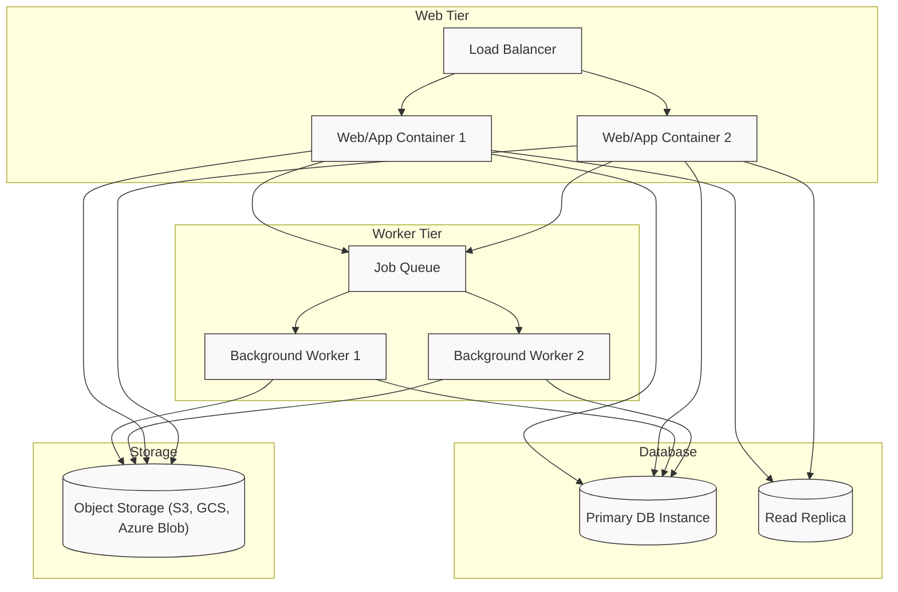

# Scaling Strategies for Linkwarden

Scaling your Linkwarden instance effectively is vital to maintain performance, reliability, and user satisfaction as your user base or data volume grows. Whether you are serving a handful of users or scaling to hundreds or thousands, this guide walks you through essential strategies to help your deployment evolve seamlessly.

---

## 1. Understanding Linkwarden's Architecture for Scaling

Linkwarden is designed with a clear separation between stateless web/application containers and stateful backend services such as the database and file storage. This modular design enables scaling components independently based on demand.

- **Stateless Web/App Containers:** Handle user requests, API operations, and UI rendering.
- **Background Workers:** Process archival, screenshot generation, AI tagging, and other asynchronous tasks.
- **Managed Database:** Store bookmarks, collections, users, and metadata.
- **File Storage:** Save webpage archives, images, PDFs, and backups.

Scaling your instance means balancing these components according to your current and anticipated workload.

---

## 2. Scaling Stateless Web and Application Containers

### Horizontal Scaling

Add more instances of your Linkwarden web/application containers behind a load balancer to distribute incoming traffic evenly. This setup:

- Improves availability and fault tolerance.
- Allows handling more concurrent users.

**Best Practices:**
- Use a managed container orchestration platform (e.g., Kubernetes, Docker Swarm) or cloud-managed services like AWS ECS/EKS, Google GKE, or Azure AKS.
- Ensure containers are truly stateless — do not rely on local session or filesystem state.
- Use sticky sessions only if necessary; prefer stateless authentication mechanisms like JWT or server-side sessions backed by a shared store.

### Load Balancing

- Implement a load balancer (e.g., NGINX, AWS ELB/ALB) to manage traffic.
- Configure health checks to route traffic only to healthy container instances.

<Tip>
Use autoscaling capabilities where possible to automatically add or remove container instances based on CPU, memory, or request throughput metrics.
</Tip>

---

## 3. Background Worker Scaling

Linkwarden uses background workers to handle time-consuming tasks such as webpage archiving, generating screenshots and PDFs, and AI-based tagging.

### Key Considerations:
- These workers should scale independently from the web/app containers.
- Increasing worker instances speeds up the processing of queued jobs and reduces latency for archival and tagging.

### Strategies:
- Use a queue system (e.g., Redis, RabbitMQ) to distribute work across many worker nodes.
- Monitor queue lengths and worker utilization to guide scaling decisions.
- Scale workers horizontally by running multiple instances.

<Note>
Ensure that workers share consistent access to storage (e.g., cloud storage or a shared filesystem) to read/write archived content.
</Note>

---

## 4. Database Scaling and Optimization

The database is the system's backbone. Linkwarden currently relies on a managed relational database (typically PostgreSQL).

### Managed Databases

- Use managed database services that provide automated backups, scaling, and failover (e.g., AWS RDS, Google Cloud SQL, Azure Database for PostgreSQL).

### Scaling Approaches

- **Vertical Scaling:** Increasing instance size (CPU, memory, IOPS) to handle larger loads.
- **Read Replicas:** Offload read-heavy operations such as dashboard queries and search to replicas.
- **Connection Pooling:** Use a connection pooler (like PgBouncer) to efficiently handle database connections.

### Performance Tuning

- Regularly analyze query performance and add indexes on frequently queried columns.
- Optimize long-running queries and prune old data if necessary.

<Warning>
Do not attempt manual sharding unless absolutely necessary—managed services provide robust scaling options.
</Warning>

---

## 5. File Storage & Archival Scaling

Webpage screenshots, PDFs, HTML archiving, and backups require substantial storage capacity.

### Storage Best Practices

- Use highly durable, scalable object storage systems, such as AWS S3, Google Cloud Storage, or Azure Blob Storage.
- Configure lifecycle policies for old or infrequently accessed archives to reduce costs.
- Linkwarden creates folders for archives per collection — ensure your storage solution supports this hierarchy or provides equivalent organization.

### Backup Storage

Keep regular backups of your database and file storage, stored in geographically separate locations for disaster recovery.

---

## 6. Common Scaling Patterns & Deployment Architectures

### Small to Medium Deployments

- Single managed database instance.
- A minimum of two web/app containers behind a load balancer.
- One or two background workers.
- Object storage for archives.

Ideal for small teams or individual users.

### Medium to Large Deployments

- Use read replicas for database.
- Autoscaling groups for web/app containers and workers.
- Integration with monitoring and alerting tools.
- Automated backups and scheduled maintenance.

### High-Demand and Enterprise Deployments

- Multi-region deployment with failover.
- Database clustering and high-availability configurations.
- Advanced caching layers (e.g., Redis or Memcached).
- Integration with CDN for static assets.
- Comprehensive monitoring and audit logs.

<Info>
Cloud offerings simplify many of these concerns by handling underlying infrastructure at scale.
</Info>

---

## 7. Monitoring, Metrics & Alerts

Effective scaling depends on visibility into your deployment.

### What to Monitor

- CPU, memory, disk I/O on containers and workers.
- Database query latency and connection counts.
- Queue lengths for background processing.
- Storage capacity and access latency.
- Application-level logs and error rates.

### Recommended Tools

- Prometheus + Grafana for metrics visualization.
- ELK (Elasticsearch, Logstash, Kibana) or managed logging solutions.
- Cloud native monitoring like AWS CloudWatch or Google Cloud Monitoring.

<Tip>
Set alert thresholds for resource usage spikes, error rate increases, and stalled queue lengths.
</Tip>

---

## 8. Troubleshooting Scaling Issues

### Slow Response Times

- Check load balancer health and distribute traffic evenly.
- Investigate database slow queries and optimize indices.
- Scale up background workers if archival jobs backlog.

### Worker Failures

- Review logs for errors.
- Ensure workers have required environment variables and storage access.

### Storage Saturation

- Verify archive retention policies.
- Archive rarely used data to cheaper storage tiers.

### Database Connection Exhaustion

- Configure connection poolers.
- Adjust maximum allowed connections.

---

## Summary

Scaling Linkwarden is about carefully balancing web server capacity, worker performance, database throughput, and storage demands. By monitoring system health and incrementally increasing resources in each layer, you can accommodate growing numbers of users and bookmarks without sacrificing performance or reliability.

---

## Additional Resources

- [Deployment Overview](/deployment/getting-started-deployment/deployment-overview)
- [Monitoring and Logging](/deployment/operational-management/monitoring-logging)
- [Backup and Disaster Recovery](/deployment/operational-management/backup-disaster-recovery)
- [Self-Hosted Installation](/getting-started/requirements-installation/self-hosted-installation)
- [Choosing Your Deployment](/getting-started/requirements-installation/choosing-your-deployment)

---

### Diagram: Scaling Architecture Overview

