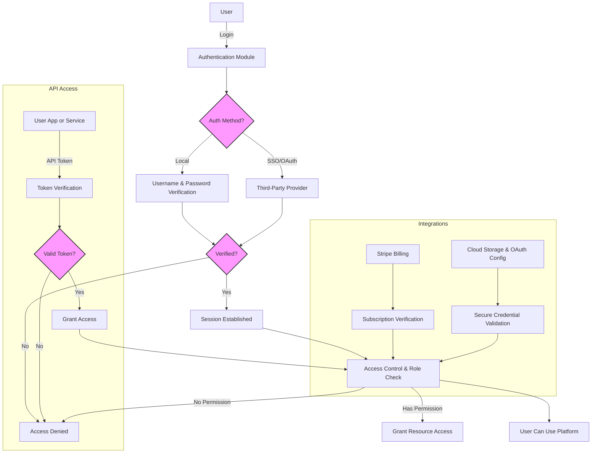

# User Management and Integrations

Manage user authentication and access securely, configure single sign-on (SSO) and OAuth providers, handle API access keys, and safely integrate third-party services to maintain seamless and controlled collaboration in Linkwarden deployments.

---

## 1. User Authentication Setup

Establish a secure and user-friendly authentication system tailored to your environment. This includes configuring local login, single sign-on (SSO), OAuth, and API key access.

### 1.1 Local Authentication

- Users sign up and log in with username/email and password.
- Passwords must meet complexity and length requirements (minimum 8 characters).
- Email verification ensures valid accounts.

### 1.2 Single Sign-On (SSO) and OAuth Providers

- Integrate external identity providers (Google, GitHub, etc.) for streamlined user access.
- Configure provider credentials and secrets within your environment variables.
- When users change their email addresses, all linked SSO sessions with that email are revoked for security.

### 1.3 API Access Tokens

- Generate personal access tokens to allow programmatic or third-party application access without exposing passwords.
- Tokens have customizable expiration durations (from 7 days to no expiration).
- Users must securely store tokens at creation as they are shown only once.
- Revoke tokens immediately when no longer needed to preserve account security.

<Tip>
Create API tokens only when necessary and treat them like passwords to prevent unauthorized access.
</Tip>

---

## 2. Access Control Management

Control who can access, view, and collaborate on data within your Linkwarden instance.

### 2.1 User Roles and Permissions

- Assign roles such as Viewer (read-only), Contributor (read and create), and Admin (full access).
- Roles determine access scope within collections and system-wide.

### 2.2 Profile Privacy and Visibility

- Users can make profiles private to restrict who can discover them.
- Whitelist trusted users by specifying their usernames, allowing profile visibility only to selected individuals.

<Tip>
Use profile privacy settings to protect personal information and control team visibility.
</Tip>

### 2.3 Team Invitations and Seat Management

- Invite new users via email to join your team.
- Accepting an invitation increases seat usage and billing automatically.
- Manage purchased seats and monitor active users through the administration interface.

<Warning>
Removing a user revokes their access and requires a new registration plus subscription to regain it.
</Warning>

---

## 3. Third-Party Integrations

Safely manage and configure external integrations essential for billing, storage, and authentication.

### 3.1 Stripe Billing Integration

- Link your Stripe account via secret keys set in environment variables.
- Use the billing portal to manage subscriptions and payments.
- Updates to email addresses in Linkwarden propagate to Stripe billing records.

### 3.2 Cloud Storage Providers

- Configure external storage services for file and archive storage (Amazon S3, Azure Blob, Google Cloud Storage, etc.) via environment variables.
- Secure credentials with proper secret management.

### 3.3 OAuth Providers and SSO Configuration

- Ensure OAuth client IDs and secrets are securely stored.
- Regularly audit linked providers and revoke outdated or unused connections.

---

## 4. Security Best Practices

Maintain a hardened, secure user environment during deployment and operations.

- **Password Management:** Enforce strong passwords and regular changes.
- **Token Security:** Limit token scope and lifetime; instruct users to store tokens safely.
- **Access Control:** Use role-based permissions and profile privacy proactively.
- **Session Management:** Automatically revoke sessions when emails change or accounts are deleted.
- **Audit and Monitoring:** Track user activities and integration usage for anomalies.
- **Environment Secrecy:** Protect secrets and keys using environment variables and secure vaults.

<Tip>
Regularly review user lists, token usage, and integration settings to reduce security risks.
</Tip>

---

## 5. Managing Users via API

Linkwarden offers user management capabilities through its API for automation and administrative workflows.

- Retrieve user information securely with authentication.
- Update user data, including roles, profile details, and permissions.
- Delete users when necessary, respecting administrative privileges and demo restrictions.

<Note>
Demo mode restricts user modification and deletion to prevent unintended data loss.
</Note>

---

## 6. Troubleshooting Common Issues

### 6.1 Authentication Failures

- Verify environment variables for authentication provider access.
- Confirm user's email verification status.
- Check subscription status when Stripe integration is enabled.
- Ensure correct roles and permissions assigned.

### 6.2 Token Problems

- Tokens are single-use views; re-creation is necessary if lost.
- Revoke unused or compromised tokens promptly.

### 6.3 Integration Errors

- Confirm third-party credentials and secrets.
- Check network connectivity and firewall configurations.
- Validate billing portal links and subscription statuses.

---

## 7. Additional Resources

- [Authentication Methods Guide](https://linkwarden.com/security/auth-and-access/authentication-methods)
- [API Access Tokens Documentation](https://linkwarden.com/api-reference/advanced-features/tokens-and-api-keys)
- [User Management and Permissions](https://linkwarden.com/guides/collaboration-sharing/user-management-permissions)
- [Environment Configuration](https://linkwarden.com/getting-started/configuration-initial-setup/environment-configuration)
- [Troubleshooting Authentication Issues](https://linkwarden.com/getting-started/troubleshooting-faq/authentication-issues)

---

## Diagram: User and Integration Access Flow

---

This diagram shows how users authenticate and access resources via local or SSO methods and how API tokens authorize programmatic access while integrations like Stripe and cloud storage services interact with access control.

---