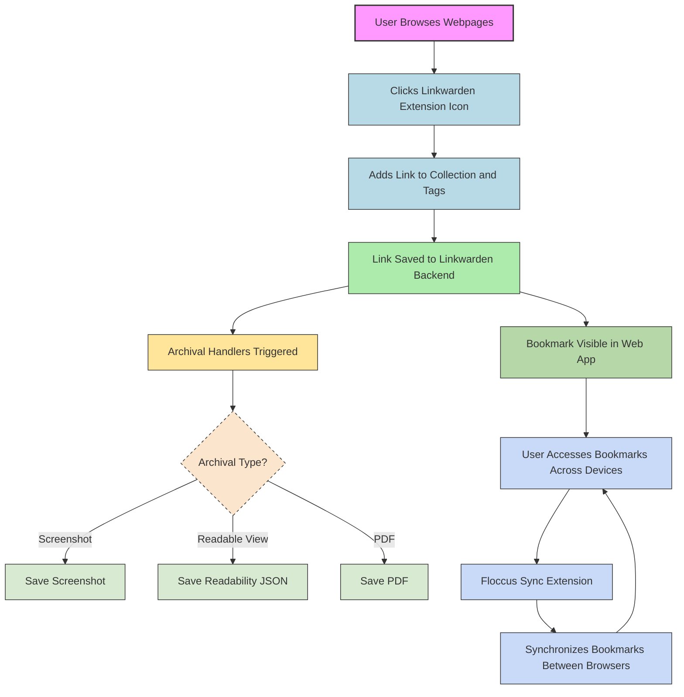

# How do I use the browser extension and synchronize bookmarks?

This guide explains how to install, connect, and effectively use the Linkwarden browser extension. It also covers synchronization of bookmarks across browsers using Floccus integration. Whether you want to quickly save and organize links directly from your browser or keep your bookmarks in sync across multiple devices, this page will guide you through the complete workflow with practical tips and troubleshooting advice.

---

## 1. Installing the Linkwarden Browser Extension

### Supported Browsers
The Linkwarden browser extension is available for major browsers including:
- Google Chrome and Chromium-based browsers (Edge, Brave, etc.)
- Mozilla Firefox
- Microsoft Edge

### Installation Steps
1. Visit the official Linkwarden extension page on your browser's extensions/add-ons store.
2. Click **Install** or **Add to Browser**.
3. After installation, you will see the Linkwarden icon in your browser toolbar.

<Tip>
If you are self-hosting Linkwarden, make sure your backend server is accessible before logging in via the extension.
</Tip>

---

## 2. Connecting the Extension to Your Linkwarden Account

1. Click the Linkwarden icon in the browser toolbar.
2. Enter your Linkwarden server URL if self-hosted, or leave default for cloud.
3. Log in with your credentials (username/password, SSO, or API token).
4. Upon successful login, the extension is ready to save and manage your bookmarks.

<Note>
Your browser extension maintains a secure session but requires periodic re-authentication depending on your server settings.
</Note>

---

## 3. Using the Browser Extension to Save and Organize Links

### Quick Link Saving Flow
- When you find a webpage you want to bookmark, click the Linkwarden icon.
- The extension popup lets you assign the link to a collection.
- Add tags, descriptions, and notes as needed for better organization.
- Optionally, choose archival options like full-page snapshot or simplified readability view, if enabled in your Linkwarden configuration.
- Click **Save** to add the bookmark.

### Organizing Bookmarks
- Use collections within the extension to group related links.
- Apply tags for faster search and filtering.
- Edit or delete bookmarks directly from the extension interface.

<Tip>
Use descriptive tags and collections consistently to maximize discoverability and long-term value of your saved links.
</Tip>

---

## 4. Synchronizing Bookmarks Across Browsers with Floccus

Linkwarden supports synchronization of bookmarks across browsers using the Floccus extension, enabling seamless access to your curated links anywhere.

### What is Floccus?
Floccus is an open-source browser extension that synchronizes bookmarks with various backends, including Linkwarden.

### Setting Up Synchronization
1. Install the Floccus extension from your browser's extension store.
2. Open Floccus settings and add a new account.
3. Select Linkwarden as your sync target.
4. Input your Linkwarden server URL and login credentials.
5. Choose which bookmark folder or collection to synchronize.
6. Start sync.

### Best Practices
- Perform an initial backup of your browser bookmarks before first synchronization.
- Use exclusive bookmark folders for Linkwarden sync to avoid conflicts.
- Regularly check sync status in Floccus to ensure up-to-date bookmarks.

<Warning>
Conflicts can arise if bookmarks are modified concurrently in multiple browsers without syncing. Resolve conflicts promptly in Floccus.
</Warning>

---

## 5. Compatibility and Integration Considerations

### Linkwarden Extension and Floccus
- Both extensions complement each other: Linkwarden for bookmarking and archiving, Floccus for cross-browser sync.
- Configure permissions carefully to avoid security risks.

### Browser Support
- Some browsers might have slight differences in extension behavior due to API disparities.
- Keep extensions updated to the latest version for optimal compatibility.

### Known Limitations
- Offline saving via the extension is limited; a stable internet connection is recommended.
- Large bookmark libraries may sync slowly or require staggered updates.

---

## 6. Troubleshooting Common Issues

<AccordionGroup title="Common Problems and Solutions">
<Accordion title="Extension Not Connecting to Server">
- Verify that your Linkwarden backend URL is correct.
- Check your network connection and firewall settings.
- Ensure CORS and HTTPS settings allow the extension to communicate.
- Try logging out and back in.
</Accordion>

<Accordion title="Bookmarks Not Syncing with Floccus">
- Confirm Floccus is configured with correct login credentials.
- Check for any sync conflict warnings in Floccus.
- Restart the browser and try syncing again.
- Review bookmark folder configurations to ensure no overlaps.
</Accordion>

<Accordion title="Saving Links Throws Errors or Fails">
- Ensure you are logged in in the extension.
- Confirm that the current page URL is valid and supported.
- Check browser console for specific error messages.
- Clear cache and reload the extension.
- Verify archival services in your Linkwarden backend are operational.
</Accordion>

<Accordion title="Extension Features Missing or Incomplete">
- Verify you are using the latest extension version.
- Some features depend on backend configuration (e.g., AI tagging, archival).
- Reload the page or browser to refresh extension state.
</Accordion>
</AccordionGroup>

---

## 7. Practical Tips and Best Practices

- **Consistent Bookmarking Habits:** Use the extension regularly to capture important links at the moment you discover them.
- **Leverage Collections and Tags:** Organize bookmarks immediately to reduce future search time.
- **Use Archival Options:** When saving critical links, employ full-page archiving or readable snapshots to guard against link rot.
- **Monitor Sync Health:** Regularly check Floccus sync status to avoid surprises.
- **Secure Your Credentials:** Use strong authentication methods as supported by your Linkwarden server.

---

## 8. Additional Resources and Next Steps

- [Saving and Organizing Links Guide](/guides/core-user-workflows/saving-links)
- [Collaborative Collections and Sharing](/guides/collaboration-sharing/creating-collaborative-collections)
- [Troubleshooting Common Setup Problems](/getting-started/troubleshooting-faq/common-setup-issues)
- [Authentication Methods Overview](/security/auth-and-access/authentication-methods)
- [Importing, Exporting, and Migrating Bookmarks](/guides/advanced-usage-integrations/import-export-migration)

Explore these documents to deepen your expertise and get the most out of Linkwarden's browser extension and synchronization capabilities.

---

## 9. Summary Diagram: Browser Extension and Synchronization Workflow

---

## 10. Support and Reporting Issues

If you encounter persistent issues with the browser extension or synchronization:

- Review the [Troubleshooting Common Setup Problems](/getting-started/troubleshooting-faq/common-setup-issues) guide.
- Check the community forums for similar issues.
- Contact Linkwarden support with detailed information, including browser, extension version, server logs, and error messages.

<Tip>
Providing clear reproduction steps helps the support team resolve your issues faster.
</Tip>