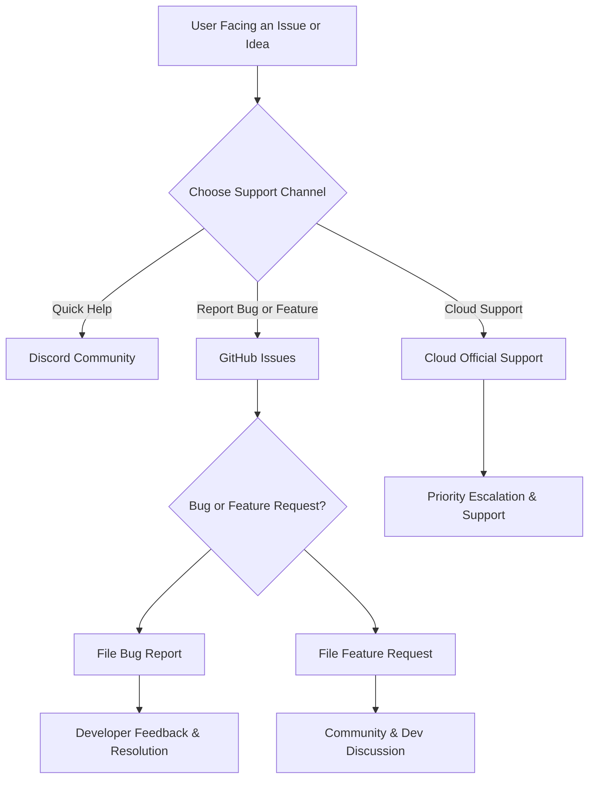

# Where Can I Get Help or Contact Support?

This page guides you on how to access support resources, report bugs, engage with the community, and escalate issues or propose feature requests for Linkwarden. Whether you're facing a technical problem, looking to contribute ideas, or want to connect with other users, this documentation provides clear pathways for obtaining assistance and collaborating effectively.

---

## Support Channels Overview

Linkwarden offers multiple ways to get help and stay connected. These channels accommodate different user preferences, whether you seek direct support, community-driven help, or want to track issues and improvement requests.

### 1. Discord Community

Join the official Linkwarden Discord server to engage in real-time conversations with other users, contributors, and occasionally developers. This is the best place to ask quick questions, share tips, and get peer support.

- **How to join:** Visit the Discord invitation link provided on the official Linkwarden website or GitHub repository.
- **Value:** Instant feedback, community discussions, and announcements.

<Info>
Be respectful and provide clear context when seeking help to enable faster and more effective responses.
</Info>

### 2. GitHub Repository

The Linkwarden GitHub repository hosts the source code, issue tracker, and feature requests.

- **Reporting Bugs:** If you experience a software bug or unexpected behavior, file an issue in the GitHub Issues section.
- **Feature Requests:** Propose new features or enhancements through feature request issues.
- **Contribution:** Review the contribution guidelines to submit pull requests and participate in development.

<Tip>
When reporting bugs, please provide detailed steps to reproduce the issue, your environment details, and any relevant logs or screenshots.
</Tip>

### 3. Cloud Contact & Support

If you are using Linkwarden’s hosted cloud service, you can contact official support directly via the provided channels.

- **Email contact:** Use the support email address available on the cloud platform’s dashboard.
- **Support Portal:** Registered cloud users may have access to a support portal for ticket submission.

<Note>
Support features may vary depending on your subscription or deployment type.
</Note>

---

## How to Report Bugs Effectively

Clear and structured bug reports accelerate problem resolution. Follow these best practices:

1. **Describe the issue clearly:** What happened, expected behavior, and actual results.
2. **Provide environment details:** App version, platform (web, mobile, cloud, self-hosted), and deployment type.
3. **Include reproduction steps:** Step-by-step guide to reproduce the problem.
4. **Attach logs or screenshots:** Visual evidence can clarify the issue.
5. **Mention related workflows:** If a bug affects particular workflows like saving links or syncing.

<Steps>
<Step title="Start GitHub Issue">
Navigate to the Linkwarden GitHub repository's Issues tab and click 'New Issue'.
</Step>
<Step title="Fill Issue Template">
Select the bug report template and fill in the requested information.
</Step>
<Step title="Submit and Monitor">
Submit your issue and watch for developer feedback or requests for additional information.
</Step>
</Steps>

---

## Participating in the Community

Beyond seeking help, you can actively contribute and benefit from the community:

- **Engage in Discussion:** Use Discord to share use cases, ask questions, and network.
- **Contribute Code:** Developers can fork and submit enhancements via GitHub.
- **Documentation Help:** Suggest and propose corrections or improvements to docs.
- **Feature Voting:** Participate in discussions on GitHub to prioritize enhancements.

<Info>
Participating in the community enriches your experience and helps improve Linkwarden for everyone.
</Info>

---

## Escalation Procedures

If your issue is critical, such as a production outage or a blocking bug:

- **For Cloud Users:** Use official support channels with priority escalation options.
- **Self-Hosted:** Reach out to community forums and GitHub; you may also consider professional support contracts.

<Warning>
Always include detailed information and timestamps to help quickly identify urgency.
</Warning>

---

## Proposing Features and Improvements

Your ideas help shape Linkwarden’s future. To propose features:

1. Check if similar requests already exist on GitHub.
2. If not, create a new feature request issue explaining the problem your feature solves.
3. Provide user scenarios, benefits, and any mockups or examples.
4. Engage in discussions and respond to feedback.

<Tip>
Clear, concise feature proposals with real-world use cases have a higher chance of prioritization.
</Tip>

---

## Summary of Support Flow

This flow ensures your needs are directed to the right resource.

---

## Additional Tips for Getting Help

- **Be Specific:** Provide detailed information; vague questions get slower responses.
- **Use Search First:** Many questions already answered in documentation or community chats.
- **Respect Channel Etiquette:** Follow community guidelines when communicating.
- **Stay Patient:** Allow time for responses, especially in community forums.

---

## Related Documentation & Resources

- [Getting Started: Account Setup and First Login](https://linkwarden.com/getting-started/configuration-initial-setup/account-setup-login)
- [Troubleshooting Common Setup Problems](https://linkwarden.com/getting-started/troubleshooting-faq/common-setup-issues)
- [Authentication & Access Issues](https://linkwarden.com/getting-started/troubleshooting-faq/authentication-issues)
- [Bug Fixes & Maintenance Changelog](https://linkwarden.com/changelog/release-history/bug-fixes-patches)
- [Feature Highlights and Roadmap](https://linkwarden.com/changelog/release-history/feature-highlights)
- [Community Guidelines and Contribution](https://github.com/linkwarden/linkwarden/blob/main/CONTRIBUTING.md)

---

## Conclusion

Using the right support channels maximizes your chances of quick resolution and valuable feedback. Engage actively with the community, provide clear information, and leverage official support when needed to get the most from Linkwarden.

For any questions beyond this guide, visiting the Discord or filing an issue on GitHub remains the fastest way to get assistance.

---