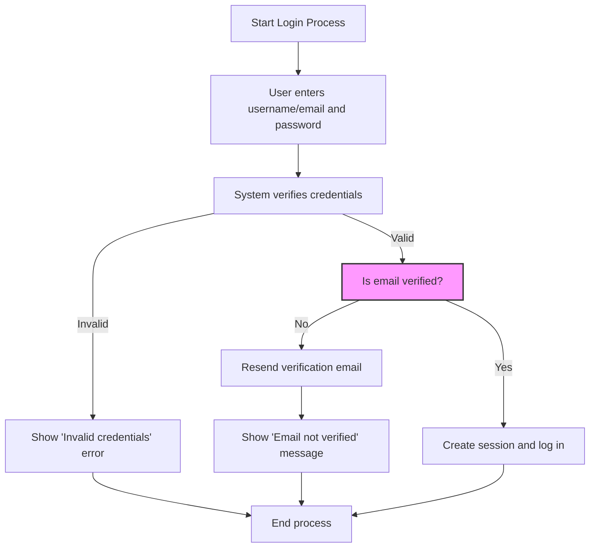

# Account Access or Login Problems

This FAQ addresses common issues users encounter when attempting to log into Linkwarden or regain access to their accounts. It provides clear guidance on verifying accounts, resetting passwords, and troubleshooting authentication hiccups to ensure smooth access to your Linkwarden workspace.

---

## 1. Why Am I Unable to Log In?

### Common Causes
- **Incorrect Username or Password:** Entering a username or email that does not match any account or typing the wrong password.
- **Unverified Email Address:** If you signed up but did not verify your email, login will be blocked for security reasons.
- **Expired or Revoked Sessions:** Previous sessions may have expired or been revoked.
- **Account Lockouts or Restrictions:** For security or subscription reasons, access might be temporarily disabled.

### What to Do
- Double-check your username/email and password for typos.
- If you have not verified your email, check your inbox (including spam) for the verification link, or trigger a resend.
- Try resetting your password if you suspect it might be forgotten or compromised.
- Contact your administrator or support if your account might be restricted.

---

## 2. How Do I Reset My Password?

Follow these steps to securely reset your Linkwarden password:

<Steps>
<Step title="Navigate to the 'Forgot Password' Link">
Click the 'Forgot Password?' link on the login page.
</Step>
<Step title="Enter Your Username or Email">
Provide the username or email associated with your Linkwarden account.
</Step>
<Step title="Receive and Follow Reset Email">
You will get an email containing a password reset link. Follow the link promptly, as it may expire.
</Step>
<Step title="Set a New Password">
Choose a strong, unique password to protect your account.
</Step>
<Step title="Log In with New Credentials">
Return to the login page and enter your username/email and new password.
</Step>
</Steps>

<Tip>
If you do not receive a reset email, check your spam folder or ensure your email system is not blocking messages from Linkwarden.
</Tip>

---

## 3. What If I Forgot Both Username and Password?

- Try any email addresses you may have registered with to initiate a password reset.
- If you cannot recall any associated email or username, contact support for help recovering access.

---

## 4. I'm Seeing "Email Not Verified" Message — What Does This Mean?

When you attempt to log in with unverified email credentials, the system blocks access until verification is complete.

### How to Resolve This
- After a failed login with this message, the site automatically resends the verification email.
- Check your email inbox and follow the link to verify.
- If you do not see the email, request a resend via the login page or support.

<Note>
Verification links expire after a limited time for security—act promptly upon receipt.
</Note>

---

## 5. Can I Use Third-Party Login Providers?

If enabled by your Linkwarden deployment, sign-in using supported external providers (Google, Apple, GitHub, etc.) is seamless:

- Simply click the relevant login button on the login page.
- Accounts created via Single Sign-On (SSO) may have auto-generated usernames and verified emails.

If you face login issues through third-party providers:

- Confirm your provider account is active and permissions are granted.
- Contact your admin if new SSO user creation is disabled.

---

## 6. How Does Linkwarden Manage Sessions and Tokens?

Linkwarden creates secure sessions after successful login, using tokens valid for an extended time (up to 30 days by default). Sessions can expire or be revoked manually.

### Troubleshooting Session Issues
- If your session has expired, you will be prompted to log in again.
- Unexpected logouts might indicate revoked tokens or security policies.
- Clearing browser cookies and cache can resolve some session anomalies.

---

## 7. What Should I Do If I Still Can't Access My Account?

- Verify your internet connection and try a different browser or device.
- Ensure your deployment isn't experiencing downtime (check status pages or admin).
- Use the 'Forgot Password' and 'Email Verification' workflows as described above.
- Reach out to Linkwarden support with details of your problem, including any error messages encountered.

---

## Additional Tips & Best Practices

- Use a password manager to store your credentials securely and avoid forgetting them.
- Keep your registered email address up to date to receive critical verification and reset emails.
- For enterprise or team users, coordinate with your administrator regarding access or permission issues.

---

## Related Documentation

- [Account Setup and First Login](/getting-started/configuration-initial-setup/account-setup-login): Step-by-step onboarding and first login.
- [Authentication Methods](/security/auth-and-access/authentication-methods): Details on supported login types and flows.
- [Troubleshooting Common Setup Problems](/getting-started/troubleshooting-faq/common-setup-issues): Deployment and environment setup issues affecting access.
- [User Management and Permissions](/guides/collaboration-sharing/user-management-permissions): Understanding access controls.
- [Where to Get Further Help](/faq/integration-support-community/where-to-find-help): Support and community resources.

---

## Troubleshooting Example: Invalid Credentials

If you receive an error such as "Invalid credentials. You might need to reset your password if you're sure you already signed up with the current username/email," it typically means:

- The username/email and password combination does not match any account.
- You may have mistyped your input.

Action:
- Use the password reset process.
- Confirm whether you use username or email to sign in depending on your deployment’s configuration.

---

## Troubleshooting Example: Too Many Verification Request Attempts

If you repeatedly request verification emails or password resets within a short time frame, the system will temporarily block further requests for your protection.

Action:
- Wait at least 5 minutes before trying again.
- Check all folders including spam.

---

## Summary Diagram: User Login Flow

---

## Getting Further Help

If problems persist after following these steps, contact Linkwarden support or your system administrator with the following information:

- Your username or registered email address.
- Any error messages you encountered.
- Steps already taken to resolve the issue.

<Tip>
Provide detailed information to expedite your assistance request.
</Tip>

---

## Conclusion

Access issues can usually be resolved via careful input verification, email confirmation, or password reset workflows. Linkwarden’s comprehensive session and authentication design strongly prioritizes security with user convenience.

Following the outlined steps will restore access promptly; for persistent or complex issues, the support team and documentation are ready to assist you.