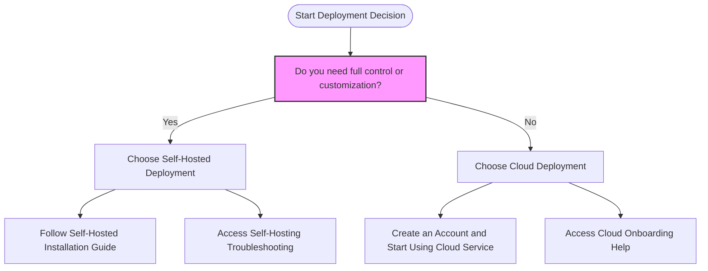

# Choosing Your Deployment: Cloud vs. Self-Hosted

Deciding how to deploy Linkwarden is a critical first step that shapes your experience, control, cost, and maintenance efforts. This page guides you through the differences between the hassle-free managed Cloud option and the powerful customizable Self-Hosted approach. Understanding these options helps you choose the best path aligned to your needs.

---

## 1. Overview: Deployment Options at a Glance

Linkwarden offers two primary deployment routes:

- **Cloud Deployment (Managed Service):** Use Linkwarden’s hosted infrastructure. We handle hosting, scaling, backups, and maintenance so you can focus on using the product.
- **Self-Hosted Deployment:** Run and manage a full Linkwarden instance on your own servers or cloud accounts. This option gives you maximum control and customization but requires technical expertise and operational responsibility.

### Why This Choice Matters

Choosing a deployment option affects:

- How quickly you start using Linkwarden
- Your ongoing operational workload
- Control over data, security, and customization
- Total cost of ownership

## 2. Cloud Deployment: Ease & Convenience

### What You Get

- Fully managed hosting on Linkwarden’s secure cloud infrastructure
- Automatic updates and maintenance
- Scalable performance that adapts to your usage
- Regular backups and disaster recovery handled for you
- Seamless onboarding without installation or system requirements

### Benefits

- **Zero setup time:** Get started immediately without worrying about infrastructure
- **No operational overhead:** Maintenance, patching, scaling, and backups are handled by us
- **Cost-effective for individual users and small teams:** Pay a simple subscription without infrastructure costs
- **Instant access to new features and security updates**

### Trade-Offs

- **Less customization:** Limited ability to modify backend or integrations
- **Data resides off-site:** Your bookmarks and data are hosted in Linkwarden’s cloud
- **Dependent on internet connectivity and cloud service stability**

<Tip>
Cloud deployment is ideal if you want to start fast, avoid infrastructure headaches, and use Linkwarden immediately with minimal management.
</Tip>

## 3. Self-Hosted Deployment: Control & Customizability

### What You Get

- Full installation of the Linkwarden backend and related services on your choice of infrastructure (on-premises servers, private cloud, or public cloud providers)
- Complete control over configuration, custom features, and integrations
- Direct ownership of all data and how it is stored
- Ability to configure security policies and backups to your corporate standards

### Benefits

- **Total autonomy:** Customize the system to suit unique workflows or corporate policies
- **Enhanced data privacy and compliance:** Keep all data within your controlled environment
- **Potential cost savings for large scale or long-term use:** Avoid subscription fees by managing your own infrastructure

### Trade-Offs

- **Requires technical skills:** Installation, configuration, updates, and ongoing operations are your responsibility
- **Operational overhead:** You must handle backups, updates, performance monitoring, and security hardening
- **Initial setup time and complexity can be significant**

<Warning>
Self-hosting is recommended only if your team has technical expertise or dedicated resources for managing server infrastructure.
</Warning>

## 4. Compare and Align Your Priorities

| Aspect            | Cloud Deployment                  | Self-Hosted Deployment            |
|-------------------|---------------------------------|----------------------------------|
| Setup Speed       | Minutes to start, no installs     | Hours to days; includes installs  |
| Maintenance       | Fully managed by Linkwarden      | Fully managed by you              |
| Customization     | Limited to app features          | Full backend and integration control|
| Cost Structure    | Subscription-based               | Infrastructure and maintenance costs|
| Security & Privacy| Data stored by Linkwarden        | Data stays within your control    |
| Scaling           | Automatic and elastic            | Manual, depends on your infrastructure|

## 5. Decision Flow: Which Deployment Fits You?

<Steps>
<Step title="You want to start quickly with minimal fuss"> Choose **Cloud Deployment** to get instant access and no maintenance burden. Perfect for individuals or small teams.<Check>
Your Linkwarden account is ready within minutes, with automatic backups and scaling.
</Check>
</Step>

<Step title="You need full control over data, security, or customization"> Select **Self-Hosted Deployment** to own your environment and tailor the system to your exact requirements.<Check>
Your team must handle installation, updates, and monitoring but gains unparalleled control.
</Check>
</Step>

<Step title="You prefer a hybrid approach"> Begin with Cloud Deployment to evaluate Linkwarden’s capabilities. Later, if advanced customization or compliance mandates arise, consider migrating to Self-Hosted Deployment.<Check>
Transition planning and data export/import guides support this path.
</Check>
</Step>
</Steps>

## 6. Next Steps

- To proceed with Cloud Deployment, visit the [Account Setup and First Login](/getting-started/configuration-initial-setup/account-setup-login) page to create your account and start using Linkwarden.
- For Self-Hosting, proceed to the [Self-Hosted Installation](/getting-started/requirements-installation/self-hosted-installation) guide for detailed setup instructions.
- Learn more about environment and backend configuration on the [Backend & Environment Configuration](/getting-started/configuration-initial-setup/environment-configuration) page.

## 7. Troubleshooting Deployment Choices

<AccordionGroup title="Common Questions">
<Accordion title="Can I change from Cloud to Self-Hosted later?">
Yes. You can export your data from the cloud version and import it into your self-hosted instance. The migration process is documented in the import-export guide.
</Accordion>
<Accordion title="What if I have limited technical skills but want to self-host?">
Self-hosting requires at least basic server administration knowledge. If you are unsure, consider the Cloud option or seek assistance from your IT team.
</Accordion>
<Accordion title="Are there cost differences between the two?">
Cloud deployment incurs subscription fees with no infrastructure costs, ideal for predictable budgeting. Self-hosting may reduce license fees but requires infrastructure, power, and maintenance costs.
</Accordion>
</AccordionGroup>

---

By making an informed deployment decision, you position yourself to get the most value from Linkwarden—whether that means rapid startup and minimal upkeep in the cloud or maximum control and customization on your own infrastructure.

If you need more detailed assistance, visit the [Troubleshooting Common Setup Problems](/getting-started/troubleshooting-faq/common-setup-issues) page or contact support through the [Where to Get Further Help](/getting-started/troubleshooting-faq/where-to-get-help) guide.

---

## Diagram: Deployment Options Decision Flow

---

# Related Links

- [Self-Hosted Installation](/getting-started/requirements-installation/self-hosted-installation)
- [Account Setup and First Login](/getting-started/configuration-initial-setup/account-setup-login)
- [Backend & Environment Configuration](/getting-started/configuration-initial-setup/environment-configuration)
- [Troubleshooting Common Setup Problems](/getting-started/troubleshooting-faq/common-setup-issues)

---

# Callouts
<Tip>
Consider your team size, technical capacity, and data sensitivity before deciding your deployment approach. Cloud is fast and easy; self-hosted offers maximum control.
</Tip>
<Warning>
Self-hosted deployments require ongoing maintenance. Neglecting updates or backups can impact security and reliability.
</Warning>
<Note>
If unsure, start with Cloud deployment to evaluate Linkwarden’s value before committing significant resources to self-hosting.
</Note>

---

**End of Choosing Your Deployment Guide**
