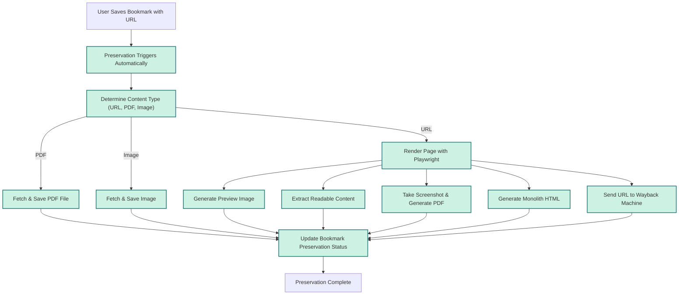

# Preserving Web Content Forever

Welcome to the definitive guide on Linkwarden's web content preservation capabilities. This page empowers you to understand and leverage the automatic and manual preservation features that keep your saved bookmarks robust and accessible long-term. You'll learn to trigger, manage, and troubleshoot archiving functionalities including screenshots, PDFs, readable HTML extraction, and integration with the Wayback Machine.

---

## 1. Understanding Linkwarden's Preservation Workflow

### What This Guide Will Help You Accomplish
This guide helps you ensure that your bookmarks are preserved beyond simple URLs — capturing snapshots, PDFs, text excerpts, and external archives that maintain the integrity and accessibility of your saved web content indefinitely.

### What You Need Before You Start
- A Linkwarden account with web or mobile access
- Bookmarks with valid URLs saved in your collections
- Preservation features enabled on your user profile or by tag settings

### What You'll Achieve
- Automatic preservation of web content as screenshots, PDFs, readable HTML
- Archiving bookmarks to the Wayback Machine for public backup
- Manual triggering of re-archiving when needed
- Understanding best practices to maximize archival success

### Time Commitment
Initial familiarization takes about 10 minutes; manual re-archiving workflows take just a couple of minutes per link.

### Difficulty Level
Beginner to Intermediate: Basic familiarity with Linkwarden bookmarks is helpful but not required.

---

## 2. How Preservation Works in Linkwarden

### Automatic Preservation Triggers
Whenever you save a bookmark with a valid URL, Linkwarden automatically initiates the preservation process if your user preferences or bookmarks' tags require archiving. Preservation types include:

- **Screenshot Capture**: Generates a full-page JPEG image snapshot
- **PDF Generation**: Creates a PDF rendering of the page
- **Readable HTML Extraction**: Uses Mozilla's Readability parser to extract the main text content
- **Monolith Archiving**: Saves a standalone HTML file capturing the page
- **Wayback Machine Submission**: Archives URLs to archive.org’s Wayback Machine

These archival tasks run in the background, leveraging Playwright to render pages and specialized processes for formats.

### Manual Preservation
You can manually trigger re-archiving of a bookmark to refresh or repair archives via the API or web UI, which clears previous preservation data and queues the link for regeneration.

### Preservation Settings
Archival behavior is controlled by a combination of user preferences and bookmark tags:

- If a bookmark has specific archival tags (e.g., `archiveAsPDF`, `archiveAsScreenshot`), these override default user settings.
- Otherwise, your user profile settings dictate which preservation methods run.

### Preservation Status Tracking
Each bookmark tracks the result of preservation tasks with flags indicating the availability or unavailability of each archive type.

---

## 3. Step-by-Step: Triggering and Managing Preservation

<Steps>
<Step title="Step 1: Verify Bookmark Has a Valid URL">
Ensure the bookmark you want to preserve has a valid, fully qualified HTTP or HTTPS URL. Preservation only works with accessible web addresses.
</Step>
<Step title="Step 2: Check Archival Settings">
Review your user profile or collection tags to confirm which archival methods are enabled (Screenshot, PDF, Readable HTML, Monolith, Wayback Machine).
</Step>
<Step title="Step 3: Save or Edit the Bookmark to Trigger Archival">
When you save a new bookmark or update an existing one, preservation begins automatically in the background.
</Step>
<Step title="Step 4: Monitor Processing Status">
Use Linkwarden's UI or API to check if the bookmark shows updated timestamps for `lastPreserved` and availability of archive files.
</Step>
<Step title="Step 5: Manually Request Re-Archiving">
If you need to refresh archives (e.g., after content changes), use the link's archive API endpoint to clear old archives and re-run preservation.
</Step>
<Step title="Step 6: Review and Access Preserved Content">
Access screenshots, PDFs, readable extracts, and archived page previews from the UI or API to confirm success.
</Step>
</Steps>

<Check>
Tip: Trigger manual re-archiving only when necessary to avoid excessive processing queues.
</Check>

---

## 4. Preservation Formats Explained

### Screenshots (Full-Page JPEG)
- Captures a full rendered page screenshot, useful for visual snapshots.
- Stored as JPEG under `archives/{collectionId}/{linkId}.jpeg`.
- Size limited by configuration (default max buffer around 100MB).

### PDFs
- Renders the webpage into a PDF file capturing styles and backgrounds.
- Stored as PDF under `archives/{collectionId}/{linkId}.pdf`.
- Ideal for printing or offline reading.

### Readable HTML Extraction
- Uses Mozilla's Readability to extract main article content, removing clutter.
- Stored as JSON in `archives/{collectionId}/{linkId}_readability.json`.
- Provides clean text content useful for searching and annotation.

### Monolith HTML
- Generates a self-contained HTML file capturing the entire page and resources.
- Stored as HTML in `archives/{collectionId}/{linkId}.html`.
- Requires `monolith` utility installed and configured.

### Wayback Machine Archiving
- Submits your link's URL to archive.org's Wayback Machine for public access.
- No local file storage; link archived externally.

---

## 5. Manually Re-Archiving a Bookmark

You can explicitly clear and re-run the preservation by calling Linkwarden's archive API endpoint:

### API Request Example
```
PUT /api/v1/links/{linkId}/archive
{
  // Intentionally empty body
}
```

This triggers:
- Deletion of existing preservation files (images, PDF, readable JSON, monolith HTML)
- Resetting preservation status flags
- Queueing the link for re-processing

### When to Manually Re-Preserve
- After significant website content changes
- If previous archive versions are corrupted or missing
- After changing preservation settings or tags

---

## 6. Best Practices for Reliable Preservation

- **Use Complete URLs:** Ensure bookmarks start with `http://` or `https://` for processing.
- **Tag Smartly:** Apply archival-specific tags to override default preservation preferences on important bookmarks.
- **Monitor Limits:** Be aware of file size limits configured for screenshots and PDFs to avoid failures.
- **Allow Processing Time:** Preservation runs in background; large or complex pages may take longer.
- **Avoid Non-Public Content:** Private or login-protected pages may not archive effectively.

---

## 7. Troubleshooting Preservation Issues

<AccordionGroup title="Common Problems and Fixes">
<Accordion title="Preservation Fails or Hangs">
- Confirm the URL is reachable and not blocked by firewall or authentication.
- Check that the browser timeout (`BROWSER_TIMEOUT`) environment setting allows enough time.
- Review system logs for errors related to Playwright or external tools.
</Accordion>
<Accordion title="Archive Files Not Created or Missing">
- Verify file size limits for screenshots, PDFs, and readability files.
- Make sure storage paths and permissions allow creating files under `archives/`.
- Check that the monolith binary is installed and accessible if used.
</Accordion>
<Accordion title="Wayback Machine Archiving Not Triggering">
- Ensure `archiveAsWaybackMachine` setting or tag is enabled.
- Confirm external HTTP requests to archive.org are allowed in your environment.
</Accordion>
<Accordion title="Unexpected 'Unavailable' Status on Archives">
- This can indicate failed processing. Manual re-archiving may help.
- Inspect logs to understand specific errors during archival.
</Accordion>
</AccordionGroup>

---

## 8. Example Preservation Workflow

Here's a brief scenario illustrating how a bookmark preservation flows in Linkwarden:



---

## 9. Next Steps & Related Documentation

- Explore [Saving and Organizing Links](/guides/core-user-workflows/saving-links) to streamline your bookmarks and ensure they trigger preservation.
- Learn about [Core Concepts & Terminology](/overview/architecture-concepts/core-concepts) to contextualize how preservation fits with collections, tags, and highlights.
- Visit [Troubleshooting Common Setup Problems](/getting-started/troubleshooting-faq/common-setup-issues) for environment or archival process errors.
- For managing collaborative collections that share archived content, see [Creating and Managing Collaborative Collections](/guides/collaboration-sharing/creating-collaborative-collections).

---

## Appendix: FAQs

<AccordionGroup title="Preservation FAQs">
<Accordion title="Can I preserve bookmarks without screenshots or PDFs?">
Yes. You can disable specific preservation types via your user preferences or by tagging bookmarks accordingly.
</Accordion>
<Accordion title="What about pages that require login or are behind paywalls?">
Archiving is limited to publicly accessible content. Private or login-required pages often cannot be fully preserved.
</Accordion>
<Accordion title="How long does preservation take?">
Typically a few minutes depending on page complexity and queue length. Large pages or PDFs may take longer.
</Accordion>
<Accordion title="Can I view the archived content within Linkwarden?">
Yes. The UI surfaces previews, PDFs, and readable text when available for convenient access.
</Accordion>
</AccordionGroup>

---

Embrace Linkwarden's preservation features to secure your knowledge and insights indefinitely—no more broken links, no more lost content. Start by verifying your bookmarks and settings, and trust the robust automated archival workflow to keep your digital library alive and accessible.


---

*This documentation page is part of the Linkwarden Guides. For further product understanding, refer to the broader [Core Benefits and Impact](/overview/introduction-value/core-benefits) overview and system [Architecture Overview](/overview/architecture-concepts/system-architecture).*
