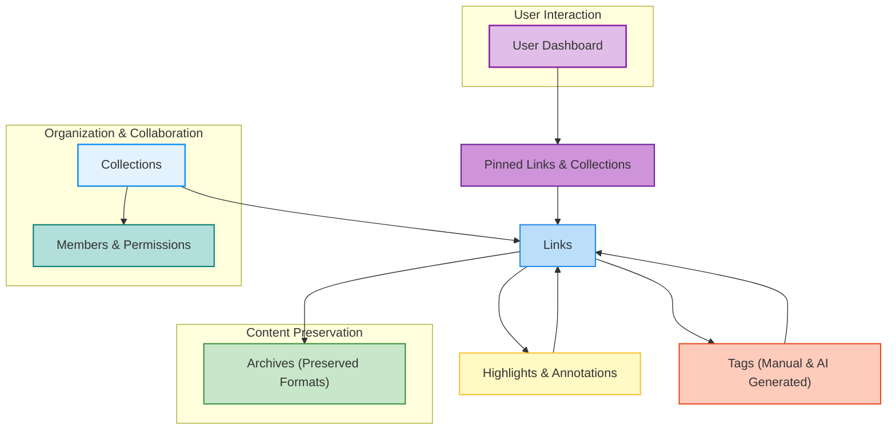

# Core Concepts & Terminology

Understanding Linkwarden begins with mastering its foundational concepts. This page clarifies the key domain-specific terms that form the backbone of your workflow: Collections, Links, Archives, Highlights, Tags, and Dashboards. Each concept is defined by its purpose and interaction with others, enabling you to make the most out of Linkwarden for organizing, preserving, and discovering web content.

---

## Collections

A **Collection** is your primary organizational container — like a folder or a project workspace. It groups related links and acts as the main context for access control, sharing, and collaboration.

- **Purpose:** Collections help you categorize your bookmarks intuitively, whether by theme, project, research topic, or team.
- **Collaboration:** Collections can include multiple members with distinct permissions (create, update, delete), making teamwork seamless.
- **Scope:** Every link belongs to exactly one collection, which determines its ownership and access rights.

_Example:_ Researching renewable energy? Create a “Renewable Energy” collection where you save, tag, annotate, and share all relevant links.

---

## Links

A **Link** represents a saved web resource or document you want to preserve and organize.

- **Types:** Links can be URLs, PDFs, images, or full webpage captures (monoliths).
- **Metadata:** Each link can have a name, URL, description, associated collection, and tags.
- **Ownership & Permissions:** Links inherit permissions from their collection, defining who can view or modify them.

_Example:_ Saving an insightful article URL, a downloadable PDF report, or an image snapshot all happen through individual Links.

---

## Archives (Preservation of Content)

**Archives** are preserved snapshots or formats of your links ensuring long-term availability and access even if the original content changes or disappears.

- **Preservation Formats:** These include screenshots, PDF captures, readable text versions, and full webpage monoliths.
- **Archival Settings:** Users control the archival methods, such as which formats to save and whether to use AI tagging during preservation.
- **Updating Archives:** Links can be re-archived or refreshed on demand to keep content current.

_Example:_ For a critical news article bookmark, Linkwarden preserves a screenshot and readable format so you can refer back regardless of external site changes.

---

## Highlights

Highlights let you interact actively with saved content by marking and annotating important parts.

- **Functionality:** You can select text in preserved content, add colored highlights, and attach comments or notes.
- **Purpose:** Highlights aid memory retention, note-taking, and collaborative review.
- **Visibility:** Highlights are linked to the specific Link and visible whenever you access the content within Linkwarden.

_Example:_ Annotate key statistics in a research paper directly within Linkwarden to quickly find important insights later.

---

## Tags

Tags provide a flexible, dynamic way to categorize and filter your links across collections.

- **Smart Organization:** Tags can be simple keywords or AI-generated labels that describe link content.
- **Filtering & Search:** Use tags to quickly find related links, or automate workflows based on archived content.
- **Archival Tags:** Special tags can trigger specific archival behaviors like capturing PDFs or screenshots.

_Example:_ Tag links as “Research,” “To-Read,” or AI-generated labels like “ClimateChange” for instant grouping.

---

## Dashboards

The **Dashboard** is your customizable landing space where you see an overview of important links and collections.

- **Pinned Links & Collections:** Highlight frequently accessed items for quick retrieval.
- **Layout Sections:** Organize dashboard views by collection, tag, or custom groupings.
- **User Preferences:** Set themes, view modes (card, list, masonry), and sorting to optimize your experience.

_Example:_ Pin your top priority collection “Project X” and important research articles on your dashboard for daily reference.

---

## How These Concepts Work Together

Linkwarden’s power lies in how these building blocks seamlessly interact to support preservation, discovery, and collaboration.

This workflow shows:

1. Collections group Links and manage user access through Members.
2. Links are saved with metadata, Tags, Highlights, and preserved as Archives.
3. Users curate their Dashboard with pinned items for quick access.

---

## Practical Tips & Best Practices

- **Use Collections Thoughtfully:** Reflect your projects or topics, facilitating natural grouping and sharing.
- **Leverage Tags Extensively:** Combine manual and AI tags for efficient searching and filtering.
- **Regularly Archive Critical Links:** Ensure key content is preserved in your preferred formats.
- **Annotate for Context:** Use Highlights to add insights or reminders that enrich your bookmarks.
- **Customize Your Dashboard:** Pin frequently used collections/links and adjust layout settings for faster workflows.

---

## Troubleshooting Common Issues

- **Missing Links in a Collection:** Check your user permissions; only members with adequate access see the links.
- **Archives Not Updated:** If preserved content is outdated, use the re-archive function on the link.
- **Tag Filters Yield No Results:** Confirm tags exist and aren’t misspelled or filtered incorrectly.
- **Dashboard Does Not Show Expected Pins:** Review pinned status as it may toggle between pinned/unpinned.

---

## Next Steps

Now that you understand these core concepts, proceed to:

- [Saving and Organizing Links](/guides/core-user-workflows/saving-links) — Learn how to add and categorize links within collections.
- [Creating and Managing Collaborative Collections](/guides/collaboration-sharing/creating-collaborative-collections) — Discover team workflows using member roles and permissions.
- [Preserving Web Content Forever](/guides/core-user-workflows/preserving-content) — Deep dive into archiving options and best practices.
- [Core Benefits and Impact](/overview/introduction-value/core-benefits) — Understand the real-world value these building blocks deliver.

---

By mastering these terms and how they interact, you unlock the full potential of Linkwarden to preserve, organize, discover, and share your valuable web knowledge efficiently and securely.
