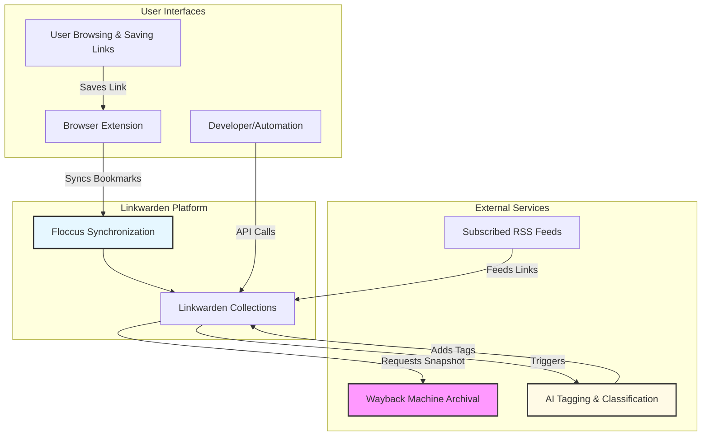

# Integrations & Extensibility

Linkwarden is designed not only as a powerful personal and collaborative link management platform but also as a seamlessly extensible ecosystem. This page provides a clear, user-centric overview of Linkwarden’s key integrations with external tools and systems, demonstrating how these connections expand its capabilities and automate your workflows.

---

## Unlocking the Power of Integrations

Imagine effortlessly expanding your link management capabilities through automation, enhanced tagging, synchronized collections, and reliable archival—all working together to save you time and boost productivity. Linkwarden's integrations make this vision a reality by connecting your bookmarking activities to popular external services and tools.

### Why Integrations Matter for You

- **Automate your workflows:** Reduce manual tasks like tagging and organizing through AI-powered tagging.
- **Preserve content reliably:** Use trusted archival services to safeguard your important web content forever.
- **Keep everything in sync:** Synchronize bookmarks across browsers and devices, ensuring accessibility anywhere.
- **Extend functionality:** Access and manage your links via APIs for custom automation and third-party integrations.

---

## Core Integrations and Extensions

### 1. Wayback Machine Archival

Linkwarden leverages the Internet Archive’s Wayback Machine to preserve snapshots of web pages you save. This integration ensures your bookmarks are not just links but a reliable preserved record, protecting against content drift or link rot.

**Real-World Scenario:** You add a link to an important research article. Linkwarden automatically requests an archival snapshot from the Wayback Machine, enabling you to access the original content even if the source page changes or disappears.

### 2. AI-Powered Tagging and Classification

Linkwarden integrates AI capabilities to analyze saved links automatically, suggesting relevant tags and classifications. This smart automation helps you quickly organize your links without manual tagging effort.

**Benefit:** Spend less time managing metadata and more time discovering insights.

### 3. Browser Extensions & Floccus Synchronization

Built-in browser extensions enable swift capturing and saving of links as you browse. Additionally, integration with Floccus lets you synchronize your browser bookmarks with Linkwarden collections effortlessly.

**User Flow:**
- Save bookmarks in your browser.
- Floccus syncs changes to Linkwarden in the background.
- Your Linkwarden collections reflect all updates instantly.

This bi-directional sync maintains consistency whether you work within the Linkwarden app or your browser.

### 4. RSS Feed Aggregation

Linkwarden can integrate with RSS feeds, allowing users to subscribe to content streams that automatically populate relevant collections. This keeps you updated with fresh content while maintaining organized curation.

### 5. APIs and Custom Automation

Beyond the user interface, Linkwarden exposes a RESTful API enabling developers and power users to:
- Create, update, and manage bookmarks and collections programmatically.
- Access real-time dashboard data and link information.
- Automate recurring tasks like bulk imports or exports.

This flexibility supports custom scripts, integrations with third-party tools, or enterprise automation.

---

## Bringing It All Together: How These Integrations Amplify Your Workflow

This flow captures how each integration connects with core user actions, enhancing every step—from link capture and preservation to organization and automation.

---

## Practical Tips & Best Practices for Effective Use

- **Enable browser extensions first:** To maximize seamless capturing, install and activate Linkwarden’s browser extensions and Floccus synchronization early.

- **Review AI tags:** While AI tagging accelerates organization, review and customize tags periodically to keep collections relevant and precise.

- **Set up API tokens securely:** Use API keys and tokens carefully for automation, safeguarding them like passwords.

- **Monitor archive status:** Occasionally confirm that Wayback Machine snapshots complete successfully for your crucial links.

- **Leverage RSS feeds for topical collections:** Use RSS sources to auto-populate collections on themes or projects, keeping your boards constantly refreshed.

---

## Common Pitfalls & Troubleshooting

<AccordionGroup title="Integrations & Extensibility Troubleshooting">
<Accordion title="Why aren’t Wayback Machine snapshots showing up?">
Sometimes archival requests may be delayed or fail due to the external service’s availability or restrictions. Check your link accessibility and try re-saving or manually requesting the archive.
</Accordion>
<Accordion title="My browser bookmarks aren’t syncing with Linkwarden">
Ensure Floccus is properly configured with the correct Profile ID and authentication details. Restart your browser and sync manually to detect changes.
</Accordion>
<Accordion title="API calls return unauthorized errors">
Verify your API tokens are valid and have the appropriate permissions. Check your request headers include Authorization with the bearer token.
</Accordion>
<Accordion title="AI tags seem inaccurate or irrelevant">
AI models improve over time but might misclassify. Manually edit tags and report recurring issues to support for refinement.
</Accordion>
</AccordionGroup>

---

## Getting Started Preview

To start extending Linkwarden with these integrations:

1. **Install the browser extension and configure Floccus:** Get them from your browser’s extension store.
2. **Verify archival settings:** Confirm Wayback Machine integration is active.
3. **Explore API access:** Generate your API token in your account settings.
4. **Subscribe to RSS feeds:** Add feeds to relevant collections in Linkwarden.
5. **Try saving links via extension and see AI tagging in action:** Observe how your collections evolve automatically.

For detailed setup instructions and advanced topics, visit the corresponding guides linked below.

---

## Related Documentation & Next Steps

- [What is Linkwarden?](../introduction-value/product-mission) — Understand the core product mission and value.
- [Core Concepts & Terminology](../architecture-concepts/core-concepts) — Learn the foundational terms that underpin Linkwarden.
- [Creating and Managing Collaborative Collections](../../collaboration-sharing/creating-collaborative-collections) — Leverage integrations in team settings.
- [APIs, Access Tokens, and Automation](../../advanced-usage-integrations/api-automation) — Dive deeper into developer integrations.
- [Saving and Organizing Links](../../core-user-workflows/saving-links) — Experience how integrations enhance daily bookmarking workflows.

---

Integrations and extensibility unlock new ways to work smarter with your links. By embracing these features, whether as an individual knowledge worker or within a collaborative team, you transform Linkwarden from a bookmark manager into a powerful, automated knowledge platform.