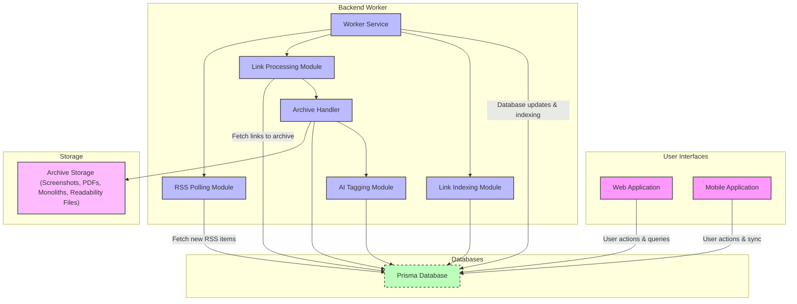

# Architecture Overview

Explore Linkwarden’s high-level system architecture that powers seamless link management, archiving, and retrieval across platforms. This page unpacks the multi-tier setup—comprising web, mobile, and worker components—details the flow of data for link preservation, and reveals Linkwarden’s modular design that ensures scalability and extensibility. A clear visual map illustrated by a Mermaid diagram provides an at-a-glance understanding of major system components and their interactions.

---

## Multi-Tier Architecture: Web, Mobile, and Worker Components

Linkwarden is designed as a modern multi-tier application to deliver a smooth user experience while handling complex asynchronous processing behind the scenes.

- **Web App:** The core interface where users save, organize, and access their links. It handles user interactions, displays stored content, and manages settings.
- **Mobile App:** Tailored for on-the-go access and link saving, syncing seamlessly with the web app.
- **Worker Service:** A background processing engine responsible for asynchronously archiving, indexing, and maintaining links. It ensures that links are preserved with rich data such as screenshots, PDFs, readable content, and AI-generated tags.

This separation enables Linkwarden to remain responsive and scalable, delivering real-time interactions without blocking users while intensive archival and computation tasks run in the background.

## Data Flow: From Archiving to Retrieval

The worker service orchestrates complex workflows that turn raw web links into preserved content ready for quick retrieval and reading:

1. **Polling RSS Feeds:** The worker polls subscribed RSS feeds to fetch new items automatically, integrating fresh content into Linkwarden.
2. **Link Processing:** It fetches batches of links pending archival or representation update. For each link, it determines the appropriate archival methods based on user preferences and tags.
3. **Archival Execution:** Using headless browsers and specialized preservation schemes, it captures screenshots, extracts readable content, creates PDFs, or packages complete pages via monolith archiving.
4. **Storage and Metadata Update:** Archived files are saved to the storage system, and link metadata is updated to reflect preservation status and enhancements like AI tagging.
5. **Indexing:** Processed links are indexed to optimize search and retrieval performance across the platform.

This efficient continuous background workflow means users can rely on Linkwarden to keep their collections up-to-date, comprehensive, and easily searchable.

## Modular Design for Extensibility

Linkwarden's architecture embraces modularity by encapsulating key functions into dedicated components:

- **Archive Handlers:** Specialized handlers manage different preservation formats (screenshots, PDFs, monolith HTMLs, readability extraction), making it straightforward to add or update archival modes without affecting other parts.
- **AI Tagging Module:** Integrates with external AI services, enabling automated content tagging for smarter organization.
- **RSS Polling Module:** Independently manages feed subscriptions and new link ingestion.
- **Worker Orchestration:** The worker launch script ensures resilience by auto-restarting in the event of failures.

This modular approach accelerates development, simplifies maintenance, and supports future enhancements, such as integrating new preservation technologies or expanding indexing capabilities.

---

## Mermaid Diagram: System Components & Interactions

---

## Practical Insights & Best Practices

- **Resilience:** The worker restart mechanism ensures uninterrupted background processing with automatic recovery from crashes.
- **Configurable Polling and Processing:** Environment variables control polling intervals, batch sizes, and preservation timeouts, allowing tailored performance based on deployment scale.
- **Selective Archiving:** Archival settings can be customized at user or tag level, optimizing resource use by preserving only required content formats.
- **AI Tagging Enablement:** AI tagging operates conditionally depending on configured AI service endpoints and user preferences, ensuring privacy and efficiency.
- **Modular Extension:** New archival handlers or indexing features can be plugged in without disrupting the core system.

---

## Troubleshooting Common Issues

- **Worker Crashes and Restarts:** The worker service logs errors and auto-restarts after 5 seconds on unexpected exits. Frequent restarts may indicate an underlying processing error requiring log inspection.
- **Archival Failures:** Links that fail preservation often log detailed errors including timeouts or buffer size excesses. Monitoring these logs helps diagnose problematic URLs or system limits.
- **RSS Polling Gaps:** If new RSS feed items are not appearing, verify polling intervals and user link capacity limits.
- **Indexing Delays:** Search indexing relies on the MeiliSearch client; failures during indexing are logged to help identify connectivity or schema issues.

For persistent problems, consult the logs and revisit configuration values documented in the environment setup guides.

---

## Next Steps

Ready to dive deeper? Explore the following documentation to complement your understanding of Linkwarden’s architecture:

- [Core Concepts & Terminology](/overview/architecture-concepts/core-concepts) for key definitions
- [Integrations & Extensibility](/overview/architecture-concepts/integration-overview) to learn how to expand Linkwarden’s capabilities
- [Getting Started: Environment Configuration](/getting-started/configuration-initial-setup/environment-configuration) for deployment preparation
- [Saving and Organizing Links](/guides/core-user-workflows/saving-links) to start making the most of your bookmarks

By mastering this architectural overview, you gain confidence in how Linkwarden sustains robust and rich link preservation for your knowledge management needs.
