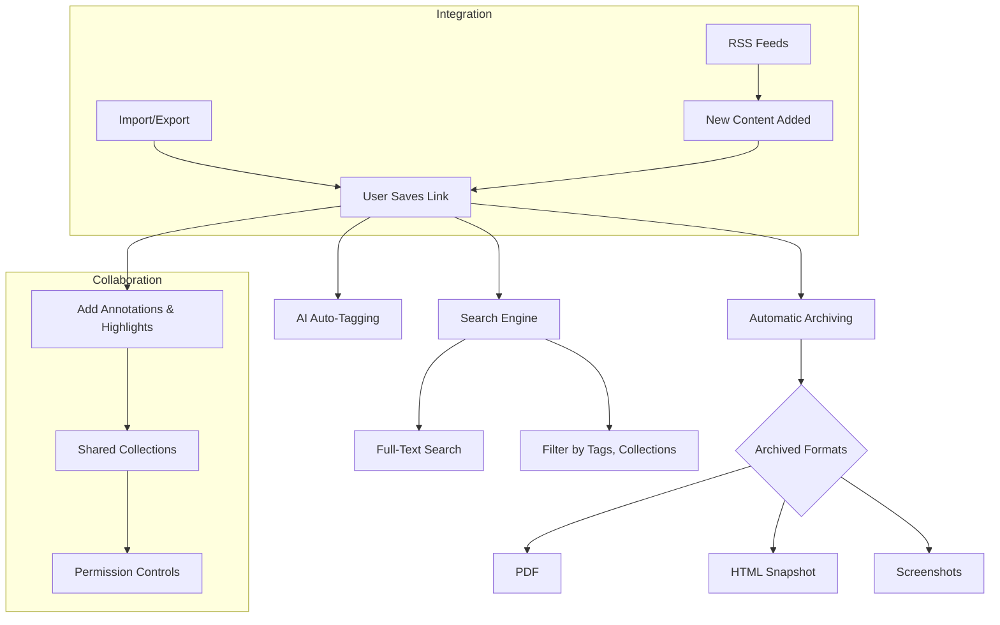

# Feature Highlights

Unlock the power of Linkwarden’s game-changing features through this high-level overview designed to quickly familiarize you with the core capabilities that transform how you save, manage, and collaborate on web content. From automated webpage archiving to AI-powered tagging, this page provides a visually guided walkthrough of each feature accompanied by real-world benefits — all to help you understand what makes Linkwarden an indispensable tool for organized, secure, and efficient digital knowledge management.

---

## Discover the Features that Set Linkwarden Apart

### Automated Webpage Archiving

Never lose essential web content again. Linkwarden automatically archives bookmarked pages in multiple formats — screenshot, PDF, and HTML — preserving the original context and enabling offline access.

**Why it matters:**
- Protects against content changes or removals over time
- Simplifies research by saving full context, not just links
- Provides versatile formats suitable for reading, sharing, or citing

### Full-Text Search Across Your Bookmarks

Effortlessly find exactly what you need. Whether searching within titles, URLs, descriptions, tags, or archived page content, Linkwarden’s robust full-text search engine delivers precise results fast.

**Real-world value:**
- Quickly locate elusive information buried deep in bookmarks
- Save time avoiding manual browsing through large collections
- Supports complex queries to refine search scope

### Collaborative Collections

Bring teams together around curated collections of links and resources. Linkwarden enables multiple users to contribute, organize, and annotate shared collections with fine-grained permission controls.

**Benefits include:**
- Streamlined collaboration without losing track of valuable resources
- Control who can view or modify shared collections
- Foster knowledge sharing and collective research efforts

### Highlighting and Annotation Tools

Interact directly with your saved content. Highlight important text passages in archived pages and add contextual comments to enhance understanding or share insights with collaborators.

**Use cases:**
- Mark key takeaways from research articles
- Leave notes for teammates reviewing resources
- Organize thoughts and reminders visually within content

### AI Auto-Tagging

Let AI assist in organizing your links effortlessly. Linkwarden automatically suggests relevant tags based on the bookmarked content, helping you maintain a clean, discoverable collection without manual overhead.

**Advantages:**
- Consistent tagging improves search and filtering
- Save time on routine organization
- Discover connections between related content

### Permission Controls

Ensure your valuable collections and bookmarks remain secure with customizable access settings, including read, update, or manage permissions for users and groups.

**Key points:**
- Protect sensitive or proprietary information
- Delegate responsibilities with clarity
- Manage visibility from private to public sharing easily

### Full Import and Export Support

Transition to Linkwarden seamlessly or share your collections externally. Easily import bookmarks from other platforms or export entire collections for backups, migrations, or offline use.

**Why it’s essential:**
- No vendor lock-in, flexible data ownership
- Simple onboarding and offboarding
- Facilitate broader sharing beyond the platform

### RSS Feed Integration

Stay up-to-date with the latest content. RSS feed support allows you to subscribe to content updates directly inside Linkwarden, keeping your collections fresh and relevant.

**Practical scenarios:**
- Follow news sources or blogs alongside your bookmarks
- Automate discovery of new content on topics of interest
- Combine archival with streaming content monitoring

---

## Visual Walkthrough of Feature Interactions

---

## Why These Features Matter

Using Linkwarden’s powerful features, knowledge workers and teams gain control over their digital resources with confidence. Imagine compiling a research dossier that remains intact years from now despite web content changes, or a marketing team curating competitive intelligence that updates live via RSS while collaborating efficiently. These features work together to:

- Save hours on manual organization and content recovery
- Increase team productivity through shared, annotated collections
- Mitigate risks of lost or altered online resources
- Enable discovery with AI and rich search capabilities

### Before and After Linkwarden
**Before:** Finding critical information involves juggling browser bookmarks, scattered notes, and uncertainty about whether content is still live or changed.

**After:** All pertinent links, their snapshots, annotations, and team insights are centralized and searchable, secured behind permission layers and enhanced with smart tagging.

---

## How to Get Started with These Features

These capabilities are all accessible through Linkwarden’s intuitive web and mobile interfaces without additional setup:

- Begin by saving a few bookmarks and see the automatic archival in action.
- Explore the highlight tool by annotating key points directly within saved pages.
- Create or join collaborative collections to experience shared curation.
- Use the search bar to find content using keywords or tags.

<Tip>
Start small—save and annotate your first few links, then gradually adopt collaboration and AI tagging features as you grow comfortable.
</Tip>

For detailed step-by-step workflows, see the [How Linkwarden Works: End-to-End Flow](/overview/feature-tour/workflow-glimpse).

---

## Troubleshooting Common Issues

- **Archived content not appearing:** Refresh your view or clear browser cache. If problem persists, verify archival settings.
- **Search returns no results:** Confirm your search term spelling and consider tags or filters applied.
- **Collaborative permissions errors:** Check that you have the correct access rights; contact collection owner if needed.
- **ANote:** Some features like AI tagging require active internet connection and proper subscription level.

For help, consult [Troubleshooting Common Setup Problems](/getting-started/troubleshooting-faq/common-setup-issues).

---

Harness the full power of your bookmarks with Linkwarden’s feature set designed to preserve, organize, and collaborate around web content seamlessly and securely.

---

## Related Documentation

- [What is Linkwarden?](/overview/introduction-value/product-mission) — Understand the mission and vision behind the product
- [Core Benefits and Impact](/overview/introduction-value/core-benefits) — Dive deeper into the long-term value of core features
- [Creating and Managing Collaborative Collections](/guides/collaboration-sharing/creating-collaborative-collections) — Detailed guide on collaboration features
- [Preserving Web Content Forever](/guides/core-user-workflows/preserving-content) — Learn all about archiving and preservation
- [Integrations & Extensibility](/overview/architecture-concepts/integration-overview) — Explore external integrations including RSS and AI services

---

Unlock Linkwarden’s full potential by mastering these transformative features and gain lasting control over your digital knowledge.
