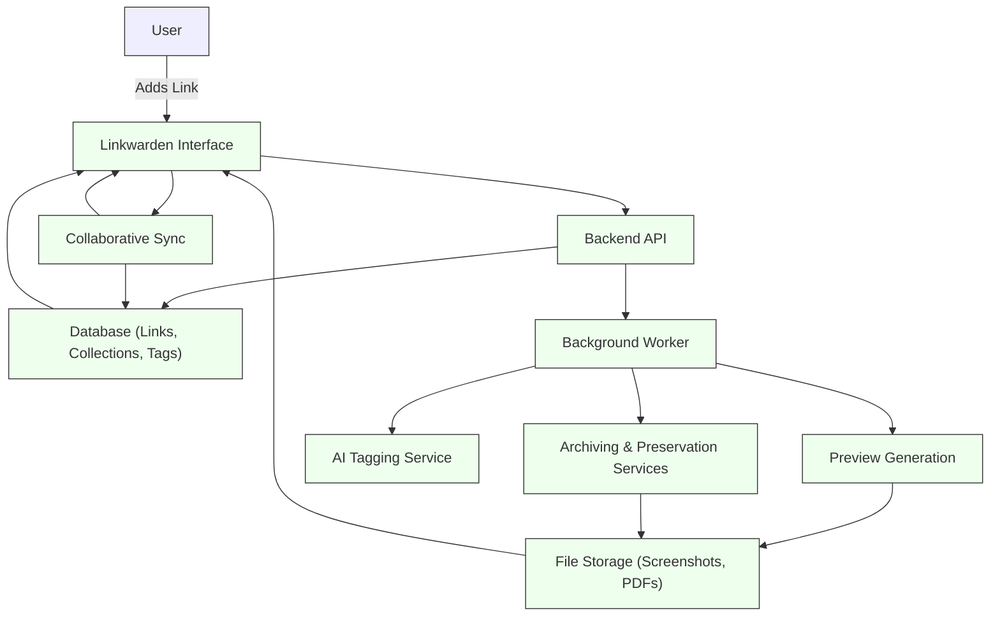

# How Linkwarden Works: End-to-End Flow

Understanding how Linkwarden operates from the moment you capture a link to when you rediscover it later is essential for mastering your bookmarking workflow. This guide walks you through a typical user journey, illustrating the seamless interaction between front-end actions and the system's background processing.

---

## Why This Matters to You

Imagine collecting valuable information daily—articles, research papers, or practical recipes—and not just saving the URL but ensuring the content remains accessible, organized, and collaborative. Linkwarden turns this imaginable scenario into reality by managing the entire lifecycle of your links automatically, with minimal effort on your part.

---

## The User Workflow: From Link to Rediscovery

### 1. Collecting a Link

- **User Intent:** Quickly save interesting URLs without losing context.
- **How It Happens:** You add a new link manually via Linkwarden’s web interface, mobile app, or browser extension.
- **Actions:** Enter URL, title (auto-generated if missing), description, and optionally assign to a collection and add tags.
 
> _Example:_ Sarah finds a detailed article on neuroscience and adds it to her “Research and Studies” collection with tags like `research` and `science`.

### 2. Archiving and Tagging

Once a link is created, the system kicks off background processes:

- **Archiving:** Linkwarden preserves the webpage in multiple formats (e.g., screenshot, PDF, archive.org snapshot) ensuring permanent access even if the original page changes or disappears.
- **Preview Generation:** The system attempts to extract an Open Graph image from the page for a visual preview; if unavailable, it generates a screenshot preview.
- **AI-Powered Tagging:** Depending on your settings, AI can auto-generate or assign tags based on the content for smarter organization.

> _Scenario:_ The neuroscience article is converted into a PDF and screenshot, while AI tags it as `health`, `science`, and `neuroscience` automatically.

### 3. Collaborating with Teammates

- **Shared Collections:** You and your team members can create or join collections where you can add, edit, or review links collaboratively.
- **Roles & Permissions:** Access levels like viewer, contributor, and admin regulate who can modify content.
- **Real-Time Updates:** Changes by collaborators sync instantly, keeping everyone on the same page.

> _Use Case:_ Sarah shares the “Research and Studies” collection with her colleagues, allowing them to add related publications or leave notes.

### 4. Adding Highlights and Notes

- **In-App Annotation:** Highlight key passages or add notes directly on saved links to capture insights or reminders.
- **Purpose:** Helps deepen interaction with content and facilitates knowledge sharing.

> _Example:_ Sarah highlights an important experiment's description and adds a note about potential follow-up.

### 5. Rediscovering Links

- **Search & Filter:** Use powerful search with filters on tags, collections, dates, and full-text in notes.
- **Dashboard & Views:** Access recently added, pinned, or frequently used links with visual previews.
- **Notifications & Recommendations:** Personalized suggestions based on your tags, collections, or collaborative activity.

> _Scenario:_ Later, Sarah searches for “neuroscience” in her dashboard and quickly finds the earlier saved article along with her highlights and team notes.

---

## Behind the Scenes: Connecting User Actions and Background Processing

Linkwarden’s smooth user experience relies on a tightly integrated system:

- **User Interface (Web/App):** The intuitive front-end where link creation, editing, tagging, and collaboration happen.
- **Background Workers:** Automatically handle archiving web content, generating previews, applying AI tagging, and synchronizing collaborative changes.
- **Database & Storage:** Efficiently store user data, links, collections, tags, archived files, and annotations.

<Tip>
If your link's preview isn’t immediately available, know that it is likely still being processed in the background. Refresh after some time to see the archived formats.
</Tip>

---

## Practical Tips for an Effective Workflow

- **Be Consistent with Collections and Tags:** Early consistent use improves discoverability and collaboration.
- **Pin Important Links:** Quickly access frequently used or critical resources from your dashboard.
- **Use Annotations Wisely:** Add meaningful notes to enrich context rather than simply to repeat the title.
- **Leverage AI Tagging:** Turn it on to save time categorizing, but review auto-assigned tags periodically for accuracy.

---

## Troubleshooting Common Situations

<AccordionGroup title="Common Challenges and Solutions">
<Accordion title="Why doesn’t my link show a preview immediately?">
Previews are generated asynchronously. Depending on server load and link complexity, archiving and preview creation may take some minutes. Refresh your saved link’s page after some time.
</Accordion>
<Accordion title="Can I edit or remove a link after creation?">
Yes. You can modify link details, tags, collections, or delete a link entirely, provided you have the necessary permissions.
</Accordion>
<Accordion title="What if archiving fails or misses formats?">
Check your settings for preservation rules and retry archiving from the link’s options. If problems persist, consult support or system admins.
</Accordion>
<Accordion title="How to collaborate if I don’t see my teammates’ changes?">
Ensure you are part of the correct collections with appropriate permissions. Network syncing issues may delay updates; try refreshing the page or logging out and back in.
</Accordion>
</AccordionGroup>

---

## Visualizing the Flow

---

## Getting Started Preview

1. **Add your first link:** Use the web app or browser extension to save a link.
2. **Assign collections and tags:** Organize your links as you add them.
3. **Wait for archiving:** Background processes will preserve and generate previews.
4. **Start collaborating:** Invite team members to share collections.
5. **Explore notes and highlights:** Deepen your link engagement.

For detailed instructions, refer to the [Saving and Organizing Links](https://linkwarden.app/guides/core-user-workflows/saving-links) and [Creating and Managing Collaborative Collections](https://linkwarden.app/guides/collaboration-sharing/creating-collaborative-collections) guides.

---

## Summary
This page outlines the typical user workflow in Linkwarden encompassing collecting links, archiving, tagging, collaborating, annotating, and rediscovery enhanced through background processing and integrations.

---