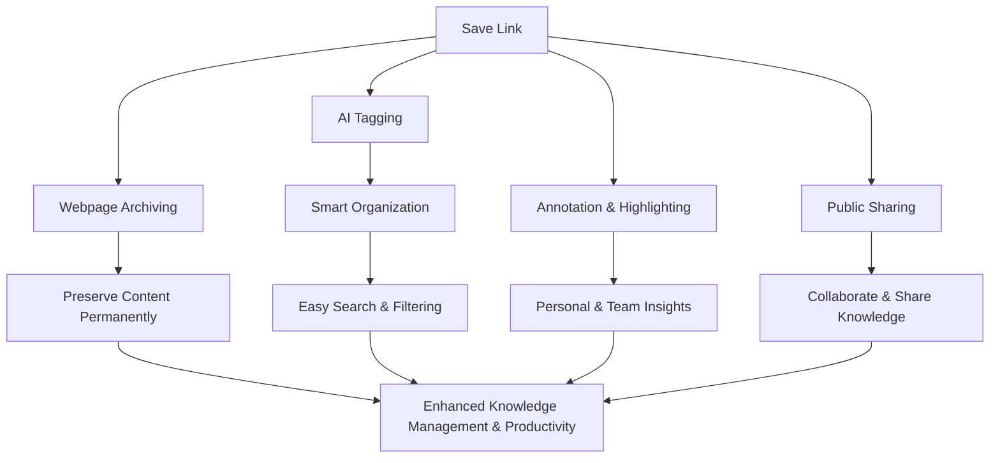

# Core Benefits and Impact

Discover how Linkwarden uniquely combines powerful features like web page archiving, AI-driven tagging, on-page annotation, and public sharing to create lasting value for individuals and organizations. This overview highlights the tangible personal and business benefits you gain by preserving knowledge, combating link rot, and enabling seamless collaboration.

---

## Unlocking Lasting Value from Your Bookmarks

Too often, valuable online information deteriorates over time—pages are moved, content changes, or links simply disappear. Linkwarden tackles this head-on with robust web page archiving that captures snapshots of your saved links instantly, preserving exactly what you intended to keep.

This permanent preservation means your knowledge and research remain accessible and trustworthy, even if the original source vanishes. Whether you're a researcher compiling sources, a team curating content, or an individual bookmarking inspiration, this guarantee transforms link collecting into lasting knowledge storage.

## AI Tagging: Smarter Organization, Faster Discovery

Linkwarden’s built-in AI tagging automatically analyzes your saved pages and suggests relevant tags that capture the content’s essence. This dramatically reduces manual effort spent tagging and organizing links, allowing you to achieve highly structured collections effortlessly.

Imagine saving a dense research article and instantly getting suggested tags like “machine learning,” “healthcare,” or “data analysis” — all generated by Linkwarden’s intelligent algorithms. These tags enhance searchability, make collaboration smoother, and help you uncover connections in your curated content you may have otherwise missed.

## Annotation and Highlighting: Interact With Your Content

Preserving a webpage is just the start—Linkwarden enables you to engage actively with your saved content. By highlighting text, adding notes, and annotating key insights directly on archived pages, you create a personalized, interactive knowledge base.

This capability is invaluable for collaborative projects, study groups, or solo deep-dive sessions. It turns static bookmarks into dynamic reference points enriched with your critical observations, fostering deeper understanding and retention.

## Public Sharing: Amplify Your Work and Collaborations

Sharing curated collections is seamless and secure with Linkwarden’s public sharing features. Publish your collections or individual links to accessible web pages with customizable privacy settings.

Whether showcasing research findings, sharing useful resources with your team, or creating a public repository of curated knowledge, this feature amplifies your impact beyond your own workflow.

<Tip>
Public sharing is designed to respect your privacy controls, ensuring you retain ownership over what is shared and keep sensitive information private.
</Tip>

## Why Should You Care? The Real-World Impact

### Preserve Knowledge Without Fear of Loss
Avoid the frustration and lost time associated with dead links and disappearing content. Linkwarden archives links automatically, creating a permanent, reliable record.

### Save Time with AI-Powered Curation
Reduce manual tagging and organizing with AI suggestions designed to keep your collections clean and accessible.

### Collaborate Effectively
Annotation and public sharing enable teams to communicate insights directly on links and work together seamlessly.

### Increase Productivity and Insight
Turn your bookmarks into actionable, well-organized knowledge that fuels smarter decisions and faster project progress.

### Protect Your Investment in Content
Whether for personal learning or business research, your curated links represent a valuable asset. Linkwarden safeguards that investment.

## Typical Use Cases Where Linkwarden Excels

- **Academic and Scientific Research:** Preserve article snapshots, annotate findings, and share collections with peers to support rigorous study.
- **Team Knowledge Bases:** Build shared collections with AI-tagged links and collaborative notes to speed up onboarding and project alignment.
- **Personal Knowledge Management:** Organize inspiration, learning materials, and important resources with effortless tagging and archiving.
- **Content Curation and Marketing:** Archive competitor analyses, curate public resources, and share collections with clients or communities.

---

## Getting Started Preview

Begin your journey by creating your first collection and saving links with instant archiving and AI tagging. Explore annotation tools right away to add personal insights. When ready, try sharing a collection publicly to experience the collaboration benefits firsthand.

For detailed step-by-step onboarding, see [Account Setup and First Login](https://linkwarden.app/getting-started/configuration-initial-setup/account-setup-login) and [Your First Bookmark: Collect, Archive, and Read](https://linkwarden.app/getting-started/configuration-initial-setup/first-bookmark-workflow).

---

## Practical Tips to Maximize Benefits

- Regularly review and customize AI-generated tags to improve accuracy over time.
- Use annotation not only for notes but as reminders and action items attached to links.
- Leverage public sharing to foster transparency and invite feedback in team settings.
- Organize collections by project, topic, or initiative to maintain clarity.

<Warning>
Avoid cluttering collections with unrelated links to keep the AI tagging and search effective.
</Warning>

## Troubleshooting Common Challenges

- **Missing Archives:** Ensure your Linkwarden instance is properly configured to archive web content at saving time.
- **AI Tagging Errors:** Tags may be inaccurate on rare occasions—manually adjust tags or train your preferences.
- **Sharing Issues:** Verify sharing permissions and privacy settings before publishing collections publicly.

---

Linkwarden’s core benefits and impact revolve around transforming how you collect, preserve, and collaborate on web content. This approach turns simple link saving into a strategic advantage for knowledge continuity and teamwork success.

---

## Related Documentation

- [What is Linkwarden?](https://linkwarden.app/overview/introduction-value/product-mission) — Understand the product’s mission and vision.
- [Who is Linkwarden For?](https://linkwarden.app/overview/introduction-value/audience-usecases) — Identify key user audiences and scenarios.
- [Saving and Organizing Links](https://linkwarden.app/guides/core-user-workflows/saving-links) — Learn practical workflows to capture and manage links.
- [Creating and Managing Collaborative Collections](https://linkwarden.app/guides/collaboration-sharing/creating-collaborative-collections) — Dive deeper into teamwork features.

---

For developers and administrators interested in how these benefits tie into the overall system, see the [Architecture Overview](https://linkwarden.app/overview/architecture-concepts/system-architecture) and [Core Concepts & Terminology](https://linkwarden.app/overview/architecture-concepts/core-concepts).

---

## Summary Diagram of Core Benefits Impact

