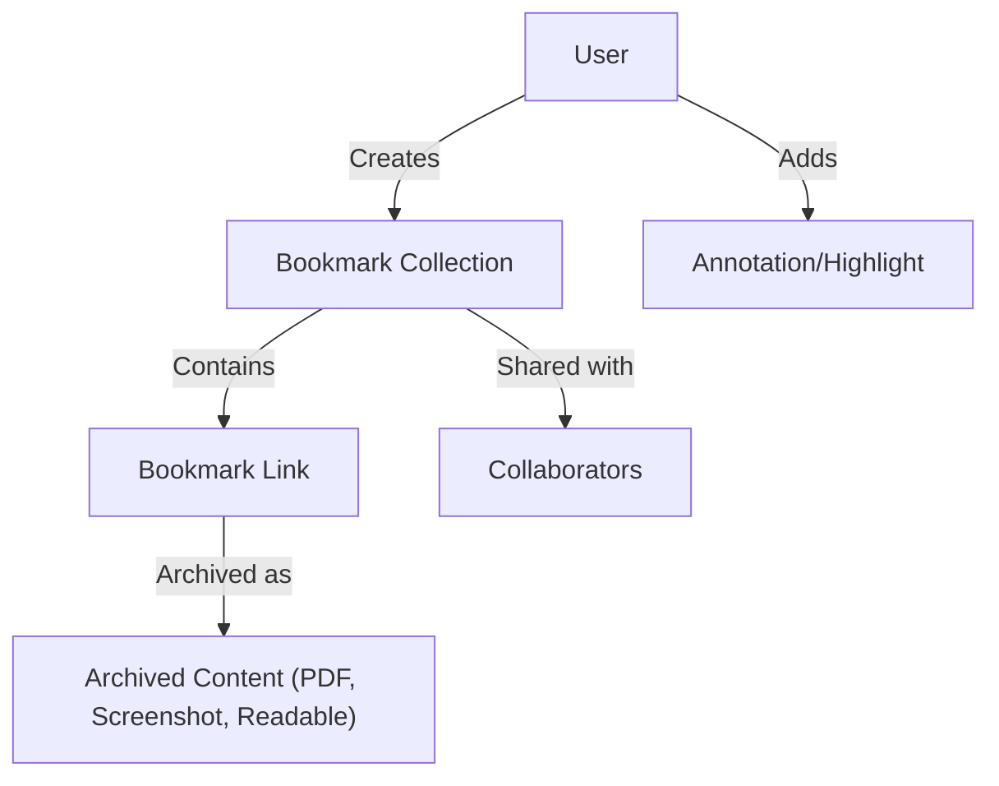

# What is Linkwarden?

## Unlocking the Future of Bookmark Management

Linkwarden is a self-hosted, open-source bookmark manager designed to revolutionize how you save, preserve, and share the knowledge you find on the web. It goes beyond simple URL storage by capturing the full content of each link, enabling annotation, collaboration, and effortless sharing — all while ensuring your vital knowledge remains accessible and intact regardless of what happens online.

---

### Why Linkwarden Matters to You

- **Complete Content Preservation:** Unlike traditional bookmarking tools that save only URLs, Linkwarden archives entire web pages—including readable content, screenshots, PDFs, and monolithic snapshots. This means your bookmarks remain useful and accurate even if the original webpage changes or disappears.
- **Collaborative Collections:** Organize links into shared collections, invite collaborators, and collectively build a rich, curated knowledge base together.
- **Annotations and Highlights:** Add notes and highlights directly onto saved content to capture context, opinions, or insights for yourself and your team.
- **Open-Source & Self-Hosted:** Maintain full control over your data and customize the platform to your needs without vendor lock-in or cloud dependency.
- **Robust Search & Organization:** Use powerful search filters and tagging to find exactly what you need, when you need it.

---

### Who Benefits Most from Linkwarden?

- **Researchers and Academics:** Securely archive papers, articles, and studies with full content and annotations for deep analysis.
- **Teams and Organizations:** Build shared collections that enhance knowledge sharing without losing context from web changes.
- **Enthusiastic Curators:** Hobbyists and professionals who want a richer way to capture and revisit content beyond just links.
- **Privacy-Conscious Users:** Those who prefer hosting their bookmark data locally or on private infrastructure.

---

## What Is Linkwarden?

At its core, Linkwarden is a collaborative bookmark manager that is self-hosted and open-source. It solves the fundamental problem of link rot and loss of context by capturing multiple layers of bookmarked content and making it effortlessly accessible.

### The Challenge

Traditional bookmark managers often store only URLs, which are prone to becoming outdated, removed, or modified. This makes it difficult to rely on bookmarks for long-term knowledge preservation or collaboration.

### Linkwarden's Solution

Linkwarden preserves the entire content of the page, not just the link:

- **Full Archives:** Screenshots, PDFs, readable text versions, and monolith captures ensure multiple fallbacks to access the original material.
- **Annotations:** Users can highlight text and add comments to captured content enhancing comprehension and collaboration.
- **Sharing & Collaboration:** Multiple users can create, contribute to, and manage collections with granular permissions.
- **Flexible Organization:** Bookmark collections can be nested, tagged, and pinned to suit your workflow.

This comprehensive approach empowers users to maintain invaluable knowledge reliably over time and across teams.

---

## Key Features & Capabilities

### 1. Full Content Preservation

Beyond the standard URL save, Linkwarden captures:
- Text content optimized for readability
- Screenshots for visual reference
- PDFs for archival quality
- Monolithic snapshots to preserve page structure and interactivity

### 2. Collaborative Collections

Create collections of bookmarks that multiple users can join with specified rights to:
- Add new links
- Edit or update existing bookmarks
- Manage tags and organization

### 3. Annotations and Highlights

Directly mark important passages or add commentary on any saved bookmark. This contextual layer helps you remember "why" a link was saved.

### 4. Powerful Search and Tagging

Search with filters including URL, name, description, type, collection, pinned status, sharing scope, date ranges, and tags to pinpoint exactly the links or collections you need.

### 5. Open-Source and Self-Hosted

With full source availability and easy self-host installation, you maintain control over security, privacy, and customization.

---

## Why Should You Care? (Benefits & Use Cases)

### What You Gain

- **Resilient Knowledge Base:** Your bookmarks never become worthless due to link rot or page modifications.
- **Shared Team Memory:** Collaborate with others without losing context or reliance on external services.
- **Context-Rich Bookmarks:** Annotations and archived content create meaningful records, not just URL lists.
- **Complete Ownership:** Data stays under your control, flexible for privacy or compliance needs.

### Common Scenarios

- A researcher archives important studies and annotates key insights to share with colleagues.
- A product team maintains a collaborative collection of market analysis articles saved as PDFs and snapshots.
- An individual curates recipes, workouts, and wellness tips with screenshots and notes for easy reference.

### Before and After Linkwarden

| Without Linkwarden                     | With Linkwarden                                 |
|--------------------------------------|------------------------------------------------|
| Bookmarks often break or get lost    | Fully preserved content keeps knowledge safe   |
| No ability to annotate or highlight | In-line notes enhance understanding and sharing|
| Limited collaboration options       | Invite team members with precise permissions  |
| Reliant on third-party services      | Self-hosted, data always under your control    |

---

## Getting Started Preview

Getting started with Linkwarden is straightforward:

- **Initial Setup:** Install Linkwarden on your preferred server or cloud environment.
- **Create Your First Collection:** Start a collection, add bookmarks with full content preservation.
- **Invite Collaborators:** Share collections and assign permissions.
- **Explore Annotations & Search:** Highlight important parts of bookmarked pages, then search efficiently.

For detailed setup, see the [Self-Hosted Installation Guide](/getting-started/requirements-installation/self-hosted-installation) and [First Bookmark Workflow](/getting-started/configuration-initial-setup/first-bookmark-workflow).

---

## Practical Tips & Best Practices

- Regularly update your preservation settings per bookmark type to balance storage and fidelity.
- Use tags and collections consistently to enhance search performance.
- Invite collaborators early for shared projects and establish clear permissions.
- Leverage annotations to capture insights immediately after saving new links.

---

<Linkwarden Image or Diagram>

---

Explore Linkwarden to redefine how you preserve and share web knowledge forever.

---

## Learn More

- [Who is Linkwarden For?](/overview/introduction-value/audience-usecases)
- [Core Benefits and Impact](/overview/introduction-value/core-benefits)
- [Feature Highlights](/overview/feature-tour/feature-highlights)
- [Getting Started with Self-Hosted Installation](/getting-started/requirements-installation/self-hosted-installation)

---

## Troubleshooting & Support

If you encounter issues or want to explore advanced scenarios, visit:
- [Troubleshooting Common Setup Problems](/getting-started/troubleshooting-faq/common-setup-issues)
- [Where to Get Further Help](/getting-started/troubleshooting-faq/where-to-get-help)

---

With Linkwarden, reclaim your bookmarks as living, collaborative knowledge—not fragile, expendable URLs.

