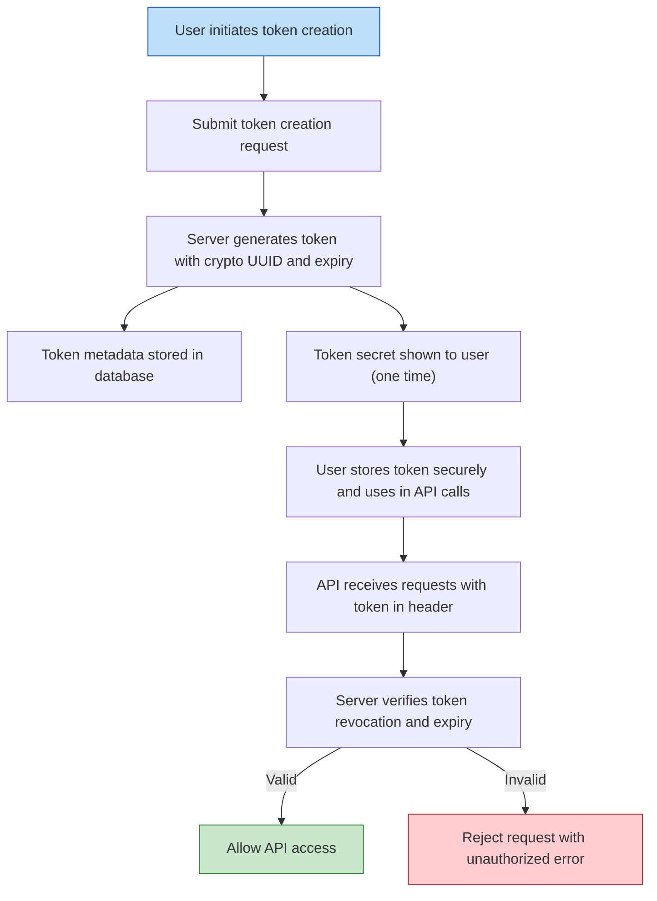

# API Access Tokens

Securely integrating Linkwarden with your workflows and external tools hinges on mastering API access tokens. This guide walks you through generating, using, and safely managing these tokens to enable programmatic access while maintaining rigorous security standards.

---

## Understanding API Access Tokens

API access tokens act as secure keys allowing external applications or scripts to interact with your Linkwarden account programmatically. Unlike your login credentials, these tokens offer scoped access, expiry controls, and easy revocation without compromising your main account password.

Tokens let you automate bookmark management, synchronize data with other tools, or build custom integrations without manual login.


## Generating API Tokens

Generating a token is straightforward but requires careful consideration around naming, expiry, and security.

<Steps>
<Step title="Open the Access Tokens Settings">
Navigate to your Linkwarden account's **Access Tokens** page via Settings.
</Step>
<Step title="Initiate New Token Creation">
Click the **New Token** button to open the creation dialog.
</Step>
<Step title="Provide a Descriptive Name">
Enter a clear, unique name that helps you identify the token’s purpose, e.g., 'Automation Script' or 'Mobile App Integration'. Avoid generic names.
</Step>
<Step title="Select Expiration Period">
Choose an expiration duration for the token: 1 week, 1 month, 2 months, 3 months, or never expire (practically 200 years).
</Step>
<Step title="Generate Token">
Confirm token creation. The system will generate a secure token string representing your API key.
</Step>
<Step title="Securely Store the Token">
**Important:** Store the generated token securely immediately, as it will only be shown once.
</Step>
</Steps>


### How Expiration Works

Tokens have configurable expiry dates to limit lifelong access, balancing convenience with security:

- **1 week:** Ideal for short-term use, like testing or one-off scripts.
- **1 month, 2 months, 3 months:** Suitable for medium-term usage scenarios.
- **Never (200 years):** Use only if absolutely necessary. Prefer revoking manually when obsolete.

Tokens expire automatically after the set time and become invalid,
forcing regeneration for further access.


## Using API Tokens

When integrating with Linkwarden APIs, include your API access token as a bearer token in the Authorization header of your HTTP requests:

```http
Authorization: Bearer <your_api_token_here>
```

This token authenticates your request, granting access without needing your username and password.

### Practical Examples of Use

- Automating bulk link imports or exports
- Syncing Linkwarden data with third-party services
- Creating custom bookmarks via scripts


## Managing Your Tokens

The Access Tokens page lists all your active tokens with these details:

| Field          | Description                               |
|----------------|-------------------------------------------|
| Name           | The token's identifier set by you         |
| Created        | Date the token was generated               |
| Expires        | Date the token will expire                 |
| Permanent Session | Tokens marked as a session token (linked to devices) |


### Revoking Tokens

To protect your account, revoke tokens when they are no longer needed or if you suspect compromise.

1. On the Access Tokens page, locate the token.
2. Click the revoke (X) icon next to its entry.
3. Confirm the revocation.

The token becomes invalid immediately, preventing further API access.


## Best Practices for Token Security

- **Use descriptive names:** Clearly label tokens to track their purpose.
- **Limit lifespan:** Choose the shortest expiry that fits your use case.
- **Never share tokens:** Treat them like passwords; do not expose in public or shared code repositories.
- **Revoke unused tokens promptly:** Clean up tokens you no longer actively use.
- **Store tokens securely:** Use environment variables, encrypted vaults, or secret managers for storage.

<Tip>
Avoid embedding tokens directly in client-side applications or scripts that may be publicly accessible.
</Tip>


## Understanding Session Tokens versus API Tokens

Some tokens are marked as **session tokens**. These represent long-lived authenticated sessions typically tied to your active devices and are automatically handled by Linkwarden.

Personal API tokens you generate for automation are distinct from session tokens and should be managed explicitly.


## Troubleshooting Common Issues

<AccordionGroup title="Common Token Issues">  
<Accordion title="Token Not Working or Unauthorized Access">  
- Ensure the token is included correctly in the Authorization header.
- Confirm the token is active and not revoked.
- Check if the token has expired—generate a new one if so.
- Verify you are targeting the correct API endpoint.
</Accordion>  
<Accordion title="Can’t Generate or Revoke Tokens">  
- Some environments, like demo mode, disable token management for security.
- Confirm you are logged in with sufficient user privileges.
- If issues persist, reach out to your administrator or support.
</Accordion>  
<Accordion title="Token Exposure Concerns">  
- Immediately revoke any token you believe was leaked or exposed.
- Review logs and API usage to detect unauthorized activity.
- Generate a replacement token and update your integrations.
</Accordion>  
</AccordionGroup>


## Under the Hood: How Tokens are Created and Stored

Each API token is cryptographically generated upon creation, embedding:

- User ID
- Issued and expiry timestamp
- Unique token identifier (UUID)

Tokens are stored securely with metadata in Linkwarden’s database, enabling revocation and expiry enforcement.


## Summary

API Access Tokens enable smooth, secure integration and automation with Linkwarden’s APIs. Use this guide to confidently create, use, and manage your tokens while adhering to security best practices that protect your account and data.


---

## Additional Resources

- [Authentication & Authorization](https://linkwarden.com/security/auth-and-access/authentication-methods)
- [API Keys & Tokens Reference](https://linkwarden.com/api-reference/advanced-features/tokens-and-api-keys)
- [Operational Security Best Practices](https://linkwarden.com/security/security-best-practices-compliance/operational-hardening)
- [API Usage Guides: Error Handling and Rate Limiting](https://linkwarden.com/api-reference/api-usage-guides/error-handling-status-codes)


---

## FAQ

**Q: Will my API tokens grant full access to my account?**

A: API tokens grant programmatic access restricted to your authorized scopes and expiry limits but do not disclose your password. Always treat them with the same security care as your credentials.


**Q: Can I recover a token if I lose it?**

A: No, the token secret is displayed only once during creation. If lost, revoke the token and create a new one.


**Q: Are session tokens and API tokens interchangeable?**

A: No. Session tokens are for device login sessions, while API tokens are intended for programmatic access and automation.


---

## Visual Flow: Generating to Using an API Token



---

This completes your authoritative guide to securely harness Linkwarden API Access Tokens for seamless automation and integration.


---